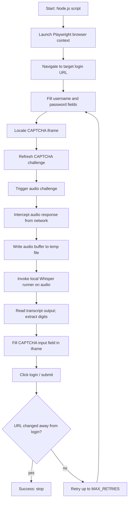
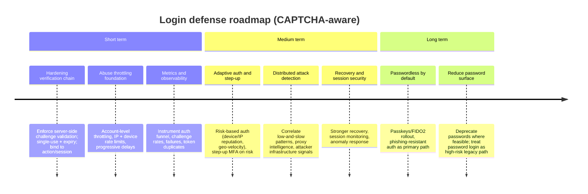

## Introduction

Every time you log into a website, you pick out crosswalk photos or squint at distorted numbers. It's annoying, but you endure it believing "this keeps my account safe."

But what if that CAPTCHA is an automatic door that real attackers walk through in zero seconds, at zero cost?

I decided not to just read the research — I built a Proof of Concept to verify it myself.

> 🔗 **Full source code**: [github.com/windshock/captcha-bypass](https://github.com/windshock/captcha-bypass)

## Related Video



## PDF



---

## An Automatic Bypass Pipeline from Three Open-Source Tools

The tools I used — all free, all open source:

- **Playwright** — Microsoft's browser automation framework. An invisible ghost that operates the keyboard and mouse on your behalf.
- **Whisper (tiny)** — OpenAI's speech recognition model. I used the ultra-lightweight version that runs entirely offline, on a local machine.
- **Alibaba Page-Agent** — An AI agent where an LLM understands a web page's DOM structure and clicks buttons from natural-language instructions alone.

Here's how the pipeline works:

1. Playwright opens the login page and fills in the username and password
2. It navigates into the CAPTCHA iframe
3. Page-Agent receives the instruction "click the audio play button," scans the DOM, and clicks it
4. Playwright intercepts the audio data at the network layer — before the sound even reaches the speakers
5. Whisper extracts digits from the noisy audio (e.g., 7, 6, 0, 0, 4, 9)
6. The extracted digits are entered into the input field and submitted
7. Login complete

Cost: $0. No paid APIs. No cloud. 100% local.

---

## How LLM Agents Changed the Rules of the Game

The most notable element here is Page-Agent.

Traditional web automation required hard-coding CSS selectors — exact addresses like `#loginname`, `.btnSound`, `#captchaTxt` baked into the code. If the site made even a minor UI change, the script broke. From a defender's perspective, obfuscating DOM structure or frequently rotating selectors was a form of defense.

But an LLM-based agent doesn't know selectors. Instead, it *reads* the page. Just as a human looks at a screen and thinks "I should click that speaker icon," the LLM analyzes the DOM tree and executes natural-language instructions.

This inverts the premise of defense. DOM obfuscation is no longer a viable protection.

---

## The Unexpected Challenge of Korean Number Recognition

There was one interesting technical hurdle.

When Whisper recognizes digits in Korean audio CAPTCHAs, it outputs a mix of Korean words and Arabic numerals — something like "팔, 2, 0, 2, 7, 4" (where 팔 = 8). The original code used a regex (`/[^0-9]/g`) that only extracted Arabic numerals, so "팔" was silently dropped.

To solve this, I built a Korean digit mapping function (`extractDigits`) — covering 영(0), 일(1), 이(2) through 구(9), plus Whisper's common misrecognitions (공→0, 빵→0, 우→5, etc.).

It seems trivial, but these details make or break a pipeline's success rate.

---

## A Docker-Based Local Test Environment

Running repeated tests against a live service raises both ethical and legal concerns. So I built a mock site with Docker:

- A login page that exactly reproduces the real service's HTML selectors
- Korean 6-digit audio CAPTCHAs generated via Google TTS
- Dual mode using Google reCAPTCHA v2 test keys (custom audio / reCAPTCHA, switchable)
- Spins up with a single `docker compose up -d`

This allows repeated validation of automation scripts without affecting any live service. In security research, a reproducible test environment is essential.

---

## You Don't Even Need to Code — The Bypass Ecosystem

Building a PoC from scratch is actually the hard way. In practice, most attackers don't write code. A commoditized market already exists.

**Human-Solver Marketplaces**

Services like 2Captcha and Anti-Captcha employ real workers in developing countries to solve CAPTCHAs. The price: $0.5–$2 per 1,000 solves — less than a tenth of a cent each. Anti-Captcha openly advertises that "100% of CAPTCHAs are solved by human workers."

**Unblocker APIs**

Services like Bright Data and Zyte go a step further, packaging proxy rotation, browser fingerprint spoofing, and automated CAPTCHA solving into a single API. The price: $1–$1.5 per 1,000 successful results. If it fails, you don't pay.

Defense costs millions. Attack costs the price of a cup of coffee. This is the real economics of CAPTCHA security.

---

## Academia Has Been Warning Us

These findings are not new.

- **unCaptcha** (USENIX WOOT 2017): Solved reCAPTCHA audio challenges with 85.15% accuracy in an average of 5.42 seconds. Google subsequently switched audio from digits to phrases, but even that response is imperfect.
- **NDSS 2023**: The "Attacks as Defenses" paper proposed designing audio CAPTCHAs robust against speech recognition attacks, but also reported that off-the-shelf ASR services achieve up to 98.3% accuracy.
- **Motoyama et al.** (USENIX Security 2010): Foundational research analyzing the economics of CAPTCHA-solving services. A "robust solving ecosystem" was already documented over 15 years ago.

The academic community has long warned that audio CAPTCHA is structurally vulnerable to ASR. This PoC merely validated that warning at the code level.

---

## The Open-Source Bypass Arsenal — Every CAPTCHA Type Has Been Broken

This PoC only targeted audio CAPTCHA, but open-source tools on GitHub already bypass every CAPTCHA modality. Let's examine a few.

### Solving Google's CAPTCHA with Google's Own STT

[sarperavci/GoogleRecaptchaBypass](https://github.com/sarperavci/GoogleRecaptchaBypass) defeats reCAPTCHA v2 audio challenges in under 5 seconds. The mechanism is almost embarrassingly simple:

1. Click the checkbox → if it doesn't auto-pass, switch to the audio challenge
2. Download the audio MP3 → convert to WAV
3. Transcribe using **Google's own Speech-to-Text API** (`speech_recognition.recognize_google()`)
4. Enter the transcription and submit

Yes — Google's own speech recognition solves Google's own CAPTCHA. The dependencies are just three packages: `pydub`, `SpeechRecognition`, and `DrissionPage`.

### Reading Image Challenges Through GPT-4o's Eyes

[aydinnyunus/ai-captcha-bypass](https://github.com/aydinnyunus/ai-captcha-bypass) leverages LLM multimodal capabilities to crack nearly every CAPTCHA type:

- **Text CAPTCHA**: Screenshots of distorted characters are sent to GPT-4o/Gemini, which reads them instantly
- **reCAPTCHA v2 image selection**: Screenshot the instruction bar → LLM identifies "motorcycles" → each tile sent to LLM in parallel → clicks only tiles containing the target object
- **Slider puzzles**: Screenshot → LLM estimates pixel distance → human-like drag → iterative correction
- **Audio**: GPT-4o-transcribe or Gemini handles speech recognition

The implication is clear: "just make the images harder" is not a defense when LLMs can see. There is no reason GPT-4o can't pick out motorcycle photos.

### Defeating Behavioral Analysis with Stealth Browsers

[Theyka/Turnstile-Solver](https://github.com/Theyka/Turnstile-Solver) bypasses Cloudflare Turnstile — the "next-generation" CAPTCHA that uses invisible JS challenges to analyze browser environment and user behavior. Even this falls:

1. Create a **fake HTML page** containing the target site's Turnstile `sitekey`
2. Use `page.route()` to intercept the target URL and serve this fake HTML — from Turnstile's JS perspective, it's on the legitimate domain
3. Run the widget in **patchright** (a Playwright fork that patches out automation detection signals) or **Camoufox** (anti-fingerprinting Firefox)
4. Turnstile determines "legitimate user" → issues token → token extracted

This directly challenges the "behavioral analysis will catch bots" defense. patchright exists specifically to remove signals like `navigator.webdriver`, and Camoufox spoofs browser fingerprints entirely.

### The Structural Collapse of CAPTCHA

Combining these three tools completes the picture:

| CAPTCHA Type | Bypass Method | Tool |
|---|---|---|
| Audio (digits) | ASR / Whisper | This PoC, GoogleRecaptchaBypass |
| Audio (phrases) | LLM speech recognition | ai-captcha-bypass (GPT-4o-transcribe) |
| Image selection | LLM vision | ai-captcha-bypass (GPT-4o/Gemini) |
| Distorted text | LLM OCR | ai-captcha-bypass |
| Slider puzzles | LLM coordinate estimation | ai-captcha-bypass |
| Behavioral analysis (Turnstile) | Stealth browser | Turnstile-Solver (patchright/Camoufox) |

Open-source bypasses already exist for every CAPTCHA modality. This table illustrates why depending on a single point of failure (CAPTCHA) is dangerous.

---

## So How Should We Actually Defend?

NIST SP 800-63B-4 and the OWASP Credential Stuffing Prevention guide share a clear conclusion:

> CAPTCHA is not a defense — it's friction.

But we need to go one step further. When you map the textbook recommendations — server-side token validation, account-level rate limiting — against this PoC's actual attack chain, the gaps become visible:

- **Single-use token validation**: This PoC doesn't replay tokens. It honestly(?) solves a fresh CAPTCHA each time, so single-use semantics don't stop this attack.
- **Account-level rate limiting**: Credential stuffing doesn't hammer the same account repeatedly. It rotates through millions of different leaked credentials. One or two attempts per account is enough — rate limits never trigger.

This is why focusing solely on "how to use CAPTCHA correctly" is insufficient. What's really needed is **defense that assumes CAPTCHA has already been bypassed**.

### Step 1: Catch Bots Acting Like Bots — Behavioral Analysis

Still valid as a first line of defense.

Playwright performs inputs with "mechanical perfection" — precise coordinate clicks without mouse movement, keystrokes at uniform intervals, page navigation without scrolling. Humans don't behave this way.

Collect and analyze these behavioral signals server-side. Cloudflare Turnstile already takes this approach — invisible JS challenges that analyze browser environment and user behavior, triggering additional challenges when scores are low.

However, **as Turnstile-Solver demonstrates, this alone is insufficient**. patchright (a Playwright fork that evades automation detection) and Camoufox (anti-fingerprinting Firefox) directly neutralize behavioral analysis. Commercial unblockers already offer human-like mouse trajectories and typing pattern simulation. Behavioral analysis raises the barrier to entry, but it is not a decisive defense on its own.

### Step 2: Harden the Audio Challenge Itself

The direct reason this PoC succeeded is the simple "6-digit number" audio format.

- **Switch from digits to phrases**: The actual response Google took after the unCaptcha disclosure. This PoC's Whisper pipeline is specialized for digit extraction, so switching to phrase-based audio neutralizes it immediately.
- **Add ASR-adversarial noise**: An approach proposed in the NDSS 2023 "Attacks as Defenses" paper. Special noise is embedded in the audio that humans can understand but machines cannot.
- **Limit audio issuance per session**: Without harming accessibility, cap the number of audio playback/refresh requests per session.

### Step 3: Attack the Root Cause — Pre-screen Leaked Passwords

The premise of credential stuffing is "a leaked password from one site works on another." Breaking this premise is far more effective than any CAPTCHA.

- Check password hashes against breach databases like Have I Been Pwned at login time
- When a login succeeds with a known-leaked password, immediately require step-up authentication or force a password change
- This defense works regardless of whether the CAPTCHA was solved or not

### Step 4: Assume the Breach — Post-Login Anomaly Detection

Bypassing CAPTCHA and guessing the right password isn't the end of the story.

Automated credential-stuffing bots exhibit distinct post-login patterns: checking point balances and cashing out immediately after login, calling specific APIs without browsing any profile, abnormally short sessions. Detect these post-login behavioral patterns and terminate the session.

### Step 5: Eliminate Passwords — MFA/Passkey

The only defense that completely severs the attack chain. Even if CAPTCHA is bypassed and the password is correct, login is impossible without the second factor.

- Short-term: SMS/TOTP-based MFA
- Long-term: Eliminate passwords entirely with Passkey/FIDO2
- As the FIDO Alliance states, no password means no credential stuffing — period

Realistically, full deployment takes time. Steps 1–4 are the bridge that fills the gap until then.

---

## What This PoC Proved

This project did not implement sophisticated commercial bypass techniques like proxy pools, distributed infrastructure, or advanced browser fingerprint spoofing. Yet a free combination of Playwright + Whisper + Page-Agent was sufficient for end-to-end login success.

At the same time, this PoC is explicitly not an "always works" tool. It can break immediately under DOM structure changes, audio endpoint changes, or a switch to phrase-based CAPTCHA. But that's not the point.

The point is this: if free tools can bypass audio CAPTCHA, there is no reason an attacker armed with billions of leaked passwords and commercial solvers at $0.001 per solve cannot do the same.

CAPTCHA is a speed bump, not a concrete wall.

> 🔗 **Full source code and Docker test environment**: [github.com/windshock/captcha-bypass](https://github.com/windshock/captcha-bypass)

---

## References

- NIST SP 800-63B-4 — Digital Identity Guidelines: Authentication and Authenticator Management
  https://pages.nist.gov/800-63-4/sp800-63b.html
- OWASP — Credential Stuffing Prevention Cheat Sheet
  https://cheatsheetseries.owasp.org/cheatsheets/Credential_Stuffing_Prevention_Cheat_Sheet.html
- Cloudflare Turnstile — Server-Side Validation
  https://developers.cloudflare.com/turnstile/get-started/server-side-validation/
- Google reCAPTCHA — Verifying the user's response
  https://developers.google.com/recaptcha/docs/verify
- FIDO Alliance — Passkeys
  https://fidoalliance.org/passkeys/
- Have I Been Pwned — Pwned Passwords API
  https://haveibeenpwned.com/API/v3#PwnedPasswords
- unCaptcha (USENIX WOOT 2017) — A Low-Resource Defeat of reCaptcha's Audio Challenge
  https://www.usenix.org/conference/woot17/workshop-program/presentation/bock
- Motoyama et al. (USENIX Security 2010) — Re: CAPTCHAs
  https://static.usenix.org/event/sec10/tech/full_papers/Motoyama.pdf
- NDSS 2023 — Attacks as Defenses: Designing Robust Audio CAPTCHAs
  https://www.ndss-symposium.org/ndss-paper/attacks-as-defenses-designing-robust-audio-captchas-using-attacks-on-automatic-speech-recognition-systems/
- Theyka/Turnstile-Solver — Cloudflare Turnstile bypass tool
  https://github.com/Theyka/Turnstile-Solver
- sarperavci/GoogleRecaptchaBypass — reCAPTCHA bypass via Google's own STT
  https://github.com/sarperavci/GoogleRecaptchaBypass
- aydinnyunus/ai-captcha-bypass — LLM multimodal CAPTCHA solver
  https://github.com/aydinnyunus/ai-captcha-bypass

---

## Appendix: Deep Research Report

### CAPTCHA Bypass Ecosystem and Login Defense Strategy Report

## Executive summary

CAPTCHA bypass has matured into a commoditized “security labor + automation” supply chain. On the low end, **human-solver marketplaces** sell solutions at roughly **sub-$1 to a few dollars per 1,000 solves** for many mainstream challenge types (e.g., image CAPTCHAs, reCAPTCHA variants, Turnstile). For example, 2Captcha lists **$0.5–$1/1,000** for image CAPTCHA and **$1–$2.99/1,000** for reCAPTCHA v2 variants, with **Turnstile at $1.45/1,000** and **audio CAPTCHA at $0.5/1,000**.  [2Captcha Pricing](https://2captcha.com/pricing); [2Captcha – Supported Types](https://2captcha.com/2captcha-api#solving_captchas); [2Captcha – For Customers](https://2captcha.com/for-customer) Anti-Captcha similarly markets volume-discounted pricing (e.g., **$0.5–$0.7/1,000** images; **$0.95–$2/1,000** reCAPTCHA v2; **$2/1,000** Turnstile) and explicitly states “**100%** of captchas are solved by **human workers**.”  [Anti-Captcha Pricing](https://anti-captcha.com/price)

On the high end, **“unblocker” products** (scraping/unblocking APIs) package **proxying + fingerprinting + retries + CAPTCHA solving** behind “pay-per-success” billing. Bright Data’s Web Unlocker pricing is framed in **$/1K results** (e.g., **$1.5/1K results** pay-as-you-go; **$1.0–$1.3/1K** at higher monthly tiers) and explicitly lists features such as **CAPTCHA solving** and **browser fingerprinting**.  [Bright Data Web Unlocker Pricing](https://brightdata.com/pricing/web-unlocker); [Bright Data Web Unlocker Features](https://docs.brightdata.com/scraping-automation/web-unlocker/features) Zyte prices “per 1,000 successful responses” with **tiered costs** and includes automation features such as **captcha** as part of the platform’s “ban handling” model.  [Zyte Pricing](https://www.zyte.com/pricing/); [Zyte Ban Management](https://www.zyte.com/automatic-ban-management-solution-zyte-api/)

Technically, bypass approaches fall into a recognizable taxonomy: (1) **human relay** and “captcha farms,” (2) **ML/OCR/ASR** (especially effective against audio digit/phrase challenges), (3) **browser/session manipulation** (automation + stealth + challenge orchestration), (4) **accessibility/audio abuse**, (5) **token/verification-chain abuse** (replay/forgery when server-side verification is weak), and (6) **behavioral evasion** (avoiding challenges by matching expected fingerprints/behavior). Academic work has long argued CAPTCHAs can be analyzed as **an economic contest**—price of bypass vs. protected asset value—supported by a “robust solving ecosystem” blending automation and real-time human labor.  [Motoyama et al. – Re: CAPTCHAs (PDF)](https://static.usenix.org/event/sec10/tech/full_papers/Motoyama.pdf); [Motoyama et al. – Re: CAPTCHAs (USENIX Security 2010)](https://www.usenix.org/conference/usenixsecurity10/re-captchas%E2%80%94understanding-captcha-solving-services-economic-context) Audio CAPTCHAs, in particular, have repeatedly been shown vulnerable to low-resource speech-recognition attacks: the **unCaptcha** project reports **85.15%** accuracy in **~5.42 seconds** on reCAPTCHA audio challenges (and notes Google’s countermeasure shift from digits to phrases).  [unCaptcha – USENIX WOOT 2017](https://www.usenix.org/conference/woot17/workshop-program/presentation/bock); [unCaptcha Paper (PDF)](https://www.usenix.org/system/files/conference/woot17/woot17-paper-bock.pdf) Research on the broader “audio CAPTCHA ecosystem” also shows high accuracy using off-the-shelf speech recognition services (e.g., “up to **98.3%** against Google’s Re-Captcha” in one study).  [NDSS 2023 – Attacks as Defenses: Robust Audio CAPTCHAs](https://www.ndss-symposium.org/ndss-paper/attacks-as-defenses-designing-robust-audio-captchas-using-attacks-on-automatic-speech-recognition-systems/)

Defensively, this implies **CAPTCHA should be treated as an auxiliary friction tool**, not a primary control for stopping credential stuffing, automated account creation, or password spraying. Modern guidance emphasizes layered controls: MFA/passkeys, risk-based step-up, and rate-limiting that considers distributed attacks. OWASP highlights MFA as the strongest defense against credential stuffing and discusses alternative defenses (including CAPTCHA) in a defense-in-depth model.  [OWASP Credential Stuffing Prevention](https://cheatsheetseries.owasp.org/cheatsheets/Credential_Stuffing_Prevention_Cheat_Sheet.html) NIST’s SP 800-63B-4 reinforces that verifiers **must implement rate limiting** for failed authentication attempts and should offer/encourage **phishing-resistant authentication** options (e.g., FIDO/WebAuthn-class).  [NIST SP 800-63B-4](https://pages.nist.gov/800-63-4/sp800-63b.html) The strategic trajectory is clear: prioritize **phishing-resistant, replay-resistant authentication** (passkeys/FIDO2) and build **distributed abuse detection** with adaptive step-up; keep CAPTCHA as one signal among many.  [FIDO Alliance – Passkeys](https://fidoalliance.org/passkeys/); [NIST SP 800-63B-4](https://pages.nist.gov/800-63-4/sp800-63b.html)

The provided seed bundle’s case study (Playwright automation that captures an **audio CAPTCHA** network response and transcribes it with a **local Whisper** invocation) maps primarily to **accessibility/audio abuse + ASR-assisted solving**, coupled with **browser automation** and **network response interception**. This reveals defender-relevant pressure points: (a) audio challenges that are “digits/phrases” are structurally compatible with ASR-based bypass, (b) automation can harvest challenge media at scale if not rate-limited and session-bound, and (c) any weakness in server-side challenge verification (token binding, single-use semantics, expiry) magnifies bypass ROI—paralleling well-documented requirements for Turnstile and reCAPTCHA verification.  [Cloudflare Turnstile Server-Side Validation](https://developers.cloudflare.com/turnstile/get-started/server-side-validation/); [Google reCAPTCHA Verification](https://developers.google.com/recaptcha/docs/verify); [unCaptcha – USENIX WOOT 2017](https://www.usenix.org/conference/woot17/workshop-program/presentation/bock)

## Market map

The table below summarizes a representative cross-section of the ecosystem. Pricing is **as posted on vendor sites** (highly subject to change). The goal is to map **service models** and **capabilities**, not to endorse usage.

| Vendor / product | Service model | Pricing model (examples) | Common supported challenge types (examples) | Notes for defenders |
|---|---|---|---|---|
| 2Captcha | Human-solver marketplace + API | Listed per 1,000 solves: image CAPTCHA **$0.5–$1**; reCAPTCHA v2 variants **$1–$2.99**; Turnstile **$1.45**; audio CAPTCHA **$0.5** (site lists “free capacity/minute” too).  [2Captcha Pricing](https://2captcha.com/pricing); [2Captcha – Supported Types](https://2captcha.com/2captcha-api#solving_captchas); [2Captcha – For Customers](https://2captcha.com/for-customer) | reCAPTCHA (v2/v3/enterprise variants), Turnstile, Arkose/FunCaptcha, GeeTest, audio/text/image types are all enumerated.  [2Captcha – Supported Types](https://2captcha.com/2captcha-api#solving_captchas); [2Captcha – For Customers](https://2captcha.com/for-customer) | Demonstrates the **commodity price band** for many CAPTCHAs; “cheap enough” to be integrated into account-creation and credential-stuffing pipelines when account value is non-trivial.  [Motoyama et al. – Re: CAPTCHAs (PDF)](https://static.usenix.org/event/sec10/tech/full_papers/Motoyama.pdf); [OWASP Credential Stuffing Prevention](https://cheatsheetseries.owasp.org/cheatsheets/Credential_Stuffing_Prevention_Cheat_Sheet.html) |
| Anti-Captcha | Human-solver marketplace + API | Per 1,000 with volume discounts: images **$0.5–$0.7**; reCAPTCHA v2 **$0.95–$2**; reCAPTCHA v3 **$1–$2**; Arkose **$3**; Turnstile **$2**.  [Anti-Captcha Pricing](https://anti-captcha.com/price) | Provides a menu including reCAPTCHA v2/v3/Enterprise, Turnstile, GeeTest, Arkose, plus “custom tasks.”  [Anti-Captcha Pricing](https://anti-captcha.com/price) | Explicitly claims **100% human** solving and very high uptime; also markets browser plugins.  [Anti-Captcha Pricing](https://anti-captcha.com/price) |
| CapSolver | Automated solver API (AI-forward positioning) | Docs list per 1,000 tokens: reCAPTCHA v2 **$0.80**; Turnstile **$1.20**; Cloudflare Challenge **$1.20**; reCAPTCHA v3 Enterprise **$3.00**; GeeTest **$1.20**; ImageToText **$0.40**.  [CapSolver Pricing](https://docs.capsolver.com/en/pricing/) | Task-type list implies coverage across reCAPTCHA variants, Turnstile, Cloudflare Challenge, GeeTest, AWS WAF-related tasks, image-to-text, etc.  [CapSolver Pricing](https://docs.capsolver.com/en/pricing/) | Automation-first services reduce latency and operational complexity versus purely human relay; defenders should expect higher throughput and better scaling.  [Scrapfly Anti-Bot Bypass docs](https://scrapfly.io/docs/scrape-api/anti-scraping-protection); [Cloudflare Turnstile Overview](https://developers.cloudflare.com/turnstile/) |
| CapMonster Cloud | Automated solver API + extensions | Pricing table: Turnstile **$1.30/1k tokens**; reCAPTCHA v3 **$0.90/1k tokens**; DataDome **$2.20/1k tokens**; text CAPTCHA **$0.30/1k tokens**; reCAPTCHA v2 shows separate “images” vs “tokens” entries (e.g., token price **$0.60/1k**).  [CapMonster Cloud Pricing](https://capmonster.cloud/en/prices) | Lists reCAPTCHA v2/v3/Enterprise, Turnstile, Cloudflare Bot Challenge, GeeTest, DataDome, Amazon WAF, etc.  [CapMonster Cloud Pricing](https://capmonster.cloud/en/prices) | Claims proxies included “in the price” for some tasks; integrated solver + proxy bundling reduces attacker friction and can complicate IP-based defenses.  [CapMonster Cloud Pricing](https://capmonster.cloud/en/prices); [OWASP Credential Stuffing Prevention](https://cheatsheetseries.owasp.org/cheatsheets/Credential_Stuffing_Prevention_Cheat_Sheet.html) |
| Death By Captcha | Hybrid: OCR + human workforce | Site states low price **$1.39 for 1,000 decoded CAPTCHAs** and also lists per-type pricing (e.g., audio CAPTCHA **$0.59/1K**, Turnstile **$2.89/1K**, reCAPTCHA V2/V3/Invisible **$2.89/1K**).  [Death By Captcha](https://deathbycaptcha.com/); [Death By Captcha Pricing](https://deathbycaptcha.com/user-pay) | Lists “Normal CAPTCHA,” reCAPTCHA variants, Turnstile, GeeTest, etc.  [Death By Captcha Pricing](https://deathbycaptcha.com/user-pay) | Hybrid positioning matters: “AI first, humans for the hard cases” is a common resilience pattern, raising baseline bypass reliability.  [Death By Captcha Pricing](https://deathbycaptcha.com/user-pay); [Motoyama et al. – Re: CAPTCHAs (PDF)](https://static.usenix.org/event/sec10/tech/full_papers/Motoyama.pdf) |
| Bright Data Web Unlocker | Unblocker API (proxy + browser emulation + retries + CAPTCHA solving) | Pricing page lists **$1.5/1K results** pay-as-you-go; higher tiers e.g., **380K results for $499/mo at $1.3/1K**, **2M results for $1999/mo at $1/1K**.  [Bright Data Web Unlocker Pricing](https://brightdata.com/pricing/web-unlocker) | Not “CAPTCHA types” per se; instead markets automated CAPTCHA solving as a component of reliable unblocking.  [Bright Data Web Unlocker Features](https://docs.brightdata.com/scraping-automation/web-unlocker/features); [Bright Data Web Unlocker Pricing](https://brightdata.com/pricing/web-unlocker) | Explicitly markets **browser fingerprinting** and multi-layer emulation (network/protocol/browser/OS signals), aligning with “behavioral evasion” strategies.  [Bright Data Web Unlocker Features](https://docs.brightdata.com/scraping-automation/web-unlocker/features); [Cloudflare Turnstile Overview](https://developers.cloudflare.com/turnstile/) |
| Zyte API | Unblocker/scraping API with tiered “success response” billing | Official pricing shows **pay-as-you-go HTTP** from **$0.13–$1.27 per 1,000** and **browser rendered** from **$1.01–$16.08 per 1,000**, with lower rates under commitments.  [Zyte Pricing](https://www.zyte.com/pricing/); [Zyte Ban Management](https://www.zyte.com/automatic-ban-management-solution-zyte-api/) | Positions itself as “ban handling,” bundling techniques needed per site (which can include challenge-solving).  [Zyte Ban Management](https://www.zyte.com/automatic-ban-management-solution-zyte-api/); [Zyte Pricing](https://www.zyte.com/pricing/) | Important defender implication: attackers can “outsource stealth + solving,” reducing the effectiveness of naive bot heuristics.  [Zyte Pricing](https://www.zyte.com/pricing/); [Cloudflare Turnstile Overview](https://developers.cloudflare.com/turnstile/) |
| ZenRows | Unblocker/scraping API | Pricing shows plan tiers (e.g., **$129/month** plan with “protected results”), and markets “CAPTCHA bypass” and pay-per-success.  [ZenRows Pricing](https://www.zenrows.com/pricing); [ZenRows Pricing](https://www.zenrows.com/pricing) | “CAPTCHA bypass” is positioned as part of “anti-bot bypass” capability; not enumerated by CAPTCHA brand in the snippet.  [ZenRows Pricing](https://www.zenrows.com/pricing); [ZenRows CAPTCHA Bypass](https://www.zenrows.com/products/universal-scraper/bypass-captcha) | Another example of “one API call” outsourcing of bypass operations; increases attacker scale and lowers operational complexity.  [ZenRows Pricing](https://www.zenrows.com/pricing); [Scrapfly Anti-Bot Bypass docs](https://scrapfly.io/docs/scrape-api/anti-scraping-protection) |
| Scrapfly Unblocker | Unblocker API | Subscription pricing begins at **$30/mo** (Discovery) and includes pay-as-you-go rates (example: “Pro” shows **$3.50 per 10k** in one table).  [Scrapfly Pricing](https://scrapfly.io/pricing) | States CAPTCHA solving included for **reCAPTCHA, hCaptcha, Turnstile** and claims pay-only-for-success.  [Scrapfly Unblocker](https://scrapfly.io/unblocker); [Scrapfly Pricing](https://scrapfly.io/pricing) | Explicitly describes coordinated fingerprint datapoints (canvas/WebGL/audio/TLS/JA3) and adaptive strategies, matching modern bot-evasion patterns.  [Scrapfly Unblocker](https://scrapfly.io/unblocker); [Cloudflare Turnstile Overview](https://developers.cloudflare.com/turnstile/) |

## Technique taxonomy

The taxonomy below emphasizes **defender-relevant** understanding: what the technique class accomplishes, what signals it tends to generate, and what mitigations reduce attacker ROI. Examples are intentionally **non-operational** (no step-by-step guidance).

| Technique family | What it is | Typical attacker advantage | Detection signals (defender view) | Practical mitigations (defender view) |
|---|---|---|---|---|
| Human relay and “captcha farms” | Real humans solve challenges (sometimes via APIs; sometimes via browser plugins). This is the classic “real-time human labor” bypass market described in economic analyses of CAPTCHA ecosystems.  [Motoyama et al. – Re: CAPTCHAs (PDF)](https://static.usenix.org/event/sec10/tech/full_papers/Motoyama.pdf); [Motoyama et al. – Re: CAPTCHAs (USENIX Security 2010)](https://www.usenix.org/conference/usenixsecurity10/re-captchas%E2%80%94understanding-captcha-solving-services-economic-context) | High compatibility across puzzle types; resiliency against frequent CAPTCHA changes; relatively low cost at scale (posted market prices).  [2Captcha Pricing](https://2captcha.com/pricing); [Anti-Captcha Pricing](https://anti-captcha.com/price) | Solve attempts correlate with automation workflows: unusual concurrency, repeated form submissions, abnormal geo/IP mix, and high-rate account creation or login attempts.  [OWASP Credential Stuffing Prevention](https://cheatsheetseries.owasp.org/cheatsheets/Credential_Stuffing_Prevention_Cheat_Sheet.html); [NIST SP 800-63B-4](https://pages.nist.gov/800-63-4/sp800-63b.html) | Treat CAPTCHA as **friction** not a gate: enforce strong auth (MFA/passkeys), throttle per-account and per-credential, and trigger step-up based on risk.  [OWASP Credential Stuffing Prevention](https://cheatsheetseries.owasp.org/cheatsheets/Credential_Stuffing_Prevention_Cheat_Sheet.html); [NIST SP 800-63B-4](https://pages.nist.gov/800-63-4/sp800-63b.html); [FIDO Alliance – Passkeys](https://fidoalliance.org/passkeys/) |
| ML/OCR vision solving | Automated recognition for text/image CAPTCHAs; modern deep learning significantly improves OCR performance.  [IEEE – Deep Learning CAPTCHA Breaking Review](https://ieeexplore.ieee.org/document/10337442); [arXiv – Deep-CAPTCHA Solver](https://arxiv.org/pdf/2006.08296) | Very low marginal cost per attempt, low latency, can be embedded in large automation. | High solve throughput; repeated failure patterns can come in “bursts” as models mis-generalize; may show consistent client fingerprints if the same automation stack is used.  [Cloudflare Turnstile Overview](https://developers.cloudflare.com/turnstile/); [OWASP Credential Stuffing Prevention](https://cheatsheetseries.owasp.org/cheatsheets/Credential_Stuffing_Prevention_Cheat_Sheet.html) | Prefer **proof/attestation-style** signals and server-side verification; degrade/step-up to phishing-resistant auth when automation risk is high.  [NIST SP 800-63B-4](https://pages.nist.gov/800-63-4/sp800-63b.html); [Cloudflare Turnstile Server-Side Validation](https://developers.cloudflare.com/turnstile/get-started/server-side-validation/); [FIDO Alliance – Passkeys](https://fidoalliance.org/passkeys/) |
| ML/ASR for audio challenges | Speech-to-text (including commodity ASR services) used to transcribe audio CAPTCHAs. unCaptcha reports strong performance and ongoing adaptation to countermeasures (digits → phrases).  [unCaptcha – USENIX WOOT 2017](https://www.usenix.org/conference/woot17/workshop-program/presentation/bock); [unCaptcha Paper (PDF)](https://www.usenix.org/system/files/conference/woot17/woot17-paper-bock.pdf) Studies also report very high accuracy against multiple audio CAPTCHA providers using off-the-shelf speech recognition.  [NDSS 2023 – Attacks as Defenses: Robust Audio CAPTCHAs](https://www.ndss-symposium.org/ndss-paper/attacks-as-defenses-designing-robust-audio-captchas-using-attacks-on-automatic-speech-recognition-systems/) | Audio CAPTCHA becomes the “weak fallback” for accessibility, yet ASR can be cheap and fast.  [unCaptcha – USENIX WOOT 2017](https://www.usenix.org/conference/woot17/workshop-program/presentation/bock); [NDSS 2023 – Attacks as Defenses: Robust Audio CAPTCHAs](https://www.ndss-symposium.org/ndss-paper/attacks-as-defenses-designing-robust-audio-captchas-using-attacks-on-automatic-speech-recognition-systems/) | Spikes in audio challenge requests (or repeated refreshes), abnormal completion times (too fast at scale), unusual distribution of failed audio attempts. | Limit audio fallback abuse without harming accessibility: strong per-session binding, single-use semantics, aggressive rate limits on audio issuance, and risk-based step-up so audio is not the only gate for high-risk actions.  [NIST SP 800-63B-4](https://pages.nist.gov/800-63-4/sp800-63b.html); [OWASP Credential Stuffing Prevention](https://cheatsheetseries.owasp.org/cheatsheets/Credential_Stuffing_Prevention_Cheat_Sheet.html); [NDSS 2023 – Attacks as Defenses (PDF)](https://www.ndss-symposium.org/wp-content/uploads/2023/02/ndss2023_f243_paper.pdf) |
| Browser automation and session manipulation | Full browser automation (Playwright/Puppeteer/Selenium) plus stealth/anti-detect layers; can include “response interception,” forced rendering paths, cookie/session handling, etc. Some commercial platforms market holistic “browser fingerprinting + retries + CAPTCHA solving.”  [Bright Data Web Unlocker Features](https://docs.brightdata.com/scraping-automation/web-unlocker/features); [Scrapfly Unblocker](https://scrapfly.io/unblocker) | Bypass is not just “solve CAPTCHA,” but “look normal enough not to get challenged,” and recover from blocks via retries/proxy rotation.  [Cloudflare Turnstile Overview](https://developers.cloudflare.com/turnstile/); [Scrapfly Anti-Bot Bypass docs](https://scrapfly.io/docs/scrape-api/anti-scraping-protection) | High automation correlation: identical TLS/client hints/header ordering across many accounts; unusual navigation timing; abnormal headless artifacts (even with modern stealth, correlation remains).  [Cloudflare Turnstile Overview](https://developers.cloudflare.com/turnstile/); [OWASP Credential Stuffing Prevention](https://cheatsheetseries.owasp.org/cheatsheets/Credential_Stuffing_Prevention_Cheat_Sheet.html) | Shift defenses to **account-level** and **behavior-level**: distributed attack detection, device binding, anomaly scoring, and step-up auth rather than relying on the browser surface alone.  [OWASP Credential Stuffing Prevention](https://cheatsheetseries.owasp.org/cheatsheets/Credential_Stuffing_Prevention_Cheat_Sheet.html); [NIST SP 800-63B-4](https://pages.nist.gov/800-63-4/sp800-63b.html); [FIDO Alliance – Passkeys](https://fidoalliance.org/passkeys/) |
| Token and verification-chain abuse | Exploiting weak validation semantics: verifying only client-side, failing to validate tokens server-side, replaying tokens, or using tokens out of context. Cloudflare explicitly warns that “client-side widget alone does not provide protection,” tokens can be forged, expire quickly, and are single-use.  [Cloudflare Turnstile Server-Side Validation](https://developers.cloudflare.com/turnstile/get-started/server-side-validation/); [Cloudflare Turnstile Server-Side Validation](https://developers.cloudflare.com/turnstile/get-started/server-side-validation/) Google similarly documents that reCAPTCHA response tokens are short-lived and single-use to prevent replay.  [Google reCAPTCHA Verification](https://developers.google.com/recaptcha/docs/verify) | High leverage if validation is wrong: bypass can become “obtain any token once” rather than “solve each time.” | Duplicate token submissions, out-of-window timestamps, same token across IPs/devices, validation failures clustered at the backend.  [Cloudflare Turnstile Server-Side Validation](https://developers.cloudflare.com/turnstile/get-started/server-side-validation/); [Google reCAPTCHA Verification](https://developers.google.com/recaptcha/docs/verify) | Enforce strict verification: server-side validation, single-use + expiry enforcement, bind token to context (action, session, device), and log/alert on duplicates.  [Cloudflare Turnstile Server-Side Validation](https://developers.cloudflare.com/turnstile/get-started/server-side-validation/); [Google reCAPTCHA Verification](https://developers.google.com/recaptcha/docs/verify) |
| Behavioral evasion and challenge avoidance | Avoid triggering CAPTCHAs by matching real-user signals. Turnstile describes non-interactive JS challenges (proof-of-work/space, API probing, behavior signals) to tune challenge difficulty.  [Cloudflare Turnstile Overview](https://developers.cloudflare.com/turnstile/) | Low friction and high throughput: “no CAPTCHA shown” means no per-solve cost and faster automation.  [Scrapfly Anti-Bot Bypass docs](https://scrapfly.io/docs/scrape-api/anti-scraping-protection); [Cloudflare Turnstile Overview](https://developers.cloudflare.com/turnstile/) | Drift in real-user behavior distributions: abnormal device diversity, time-of-day patterns, session depth anomalies; increased “successful” logins followed by suspicious post-login activity.  [NIST SP 800-63B-4](https://pages.nist.gov/800-63-4/sp800-63b.html); [OWASP Credential Stuffing Prevention](https://cheatsheetseries.owasp.org/cheatsheets/Credential_Stuffing_Prevention_Cheat_Sheet.html) | Risk-based adaptive auth: detect anomalies pre- and post-login; step-up on suspicious contexts; reduce password reliance with phishing-resistant auth (passkeys).  [NIST SP 800-63B-4](https://pages.nist.gov/800-63-4/sp800-63b.html); [FIDO Alliance – Passkeys](https://fidoalliance.org/passkeys/); [OWASP Credential Stuffing Prevention](https://cheatsheetseries.owasp.org/cheatsheets/Credential_Stuffing_Prevention_Cheat_Sheet.html) |

## Case study mapping of the provided seed bundle

### What was analyzed and what was not

The analysis below is constrained to what is explicitly present in **llm-handoff-bundle-2026-03-26.zip** (docs, code, and limited evidence artifacts) as described by you. Notably excluded items (e.g., **`.env` credentials**, **`models/tiny.pt`**, **node_modules**, full session video) create real limits on reproducibility and verification of runtime claims.

### Architecture and data flow

Based on the bundle’s code structure, the automation is a classic “login bot pipeline” with an **audio CAPTCHA acquisition step**, followed by **local ASR transcription**, then **form submission** and retry logic. The high-level flow:



### Mapping to the taxonomy

This seed bundle maps most directly to:

* **Accessibility/audio abuse + ASR**: it targets an audio challenge (digit transcription), aligning with known weaknesses of audio CAPTCHAs to ASR-based bypass. This is consistent with public research showing strong performance for automated attacks on audio CAPTCHAs (e.g., unCaptcha’s results, and AudioBreaker-style approaches).  [unCaptcha – USENIX WOOT 2017](https://www.usenix.org/conference/woot17/workshop-program/presentation/bock); [NDSS 2023 – Attacks as Defenses: Robust Audio CAPTCHAs](https://www.ndss-symposium.org/ndss-paper/attacks-as-defenses-designing-robust-audio-captchas-using-attacks-on-automatic-speech-recognition-systems/)  
* **Browser automation and session manipulation**: it uses Playwright to drive a real browser session and then uses network interception (waiting for particular response patterns) to capture the audio payload. This aligns with the broader industry trend where “unblockers” advertise browser-level emulation and automation “under the hood.”  [Bright Data Web Unlocker Features](https://docs.brightdata.com/scraping-automation/web-unlocker/features); [Scrapfly Unblocker](https://scrapfly.io/unblocker)

### Explicit assumptions and fragile points

The seed bundle’s approach depends on assumptions that are commonly fragile in real deployments:

**DOM and iframe contract assumptions.** The code assumes stable selectors (login fields, CAPTCHA iframe ID, audio button class, refresh button class, CAPTCHA input ID). Minor UI refactors can break automation quickly.

**Network identification of the audio payload.** The capture logic appears to match responses by URL/content-type heuristics. This is brittle to changes like: different endpoints, encrypted/streamed audio, or non-audio content-types (a phenomenon the code already anticipates by also accepting some `.jsp` responses).

**Challenge format assumption (“digits” / fixed length).** The automation appears to expect a numeric transcript with a minimum length (e.g., ≥5 digits) before attempting submission. This is directly in the blast radius of a known defensive move: switching from digits to phrases (Google did this for reCAPTCHA audio challenges after unCaptcha disclosure).  [unCaptcha – USENIX WOOT 2017](https://www.usenix.org/conference/woot17/workshop-program/presentation/bock); [unCaptcha Paper (PDF)](https://www.usenix.org/system/files/conference/woot17/woot17-paper-bock.pdf)

**Local model reproducibility and supply-chain dependencies.** The Whisper invocation depends on a local model artifact (explicitly called out as missing from the bundle) and on an available Whisper runner + FFmpeg environment. In practice, this creates three reproducibility failure modes: model absent, runner absent/misconfigured, or FFmpeg absent—any one degrades the “solver” step into retries/failures.

### Evidence-supported facts vs. unverified claims

Given the bundle contents, a rigorous stance is:

**Evidence-supported (by code and included artifacts):**  
The repository implements a Playwright-based login attempt with an audio-captcha-solving step and a “retry up to N times” control loop; it includes screenshot/video artifacts consistent with a login automation effort.

**Plausible but unverified (requires missing artifacts / live execution):**  
Actual success rate against the target login, whether the audio interception reliably captures correct audio, and whether Whisper yields sufficiently accurate digit extraction in a production setting. Public evidence strongly suggests audio challenges are generally susceptible to ASR, but that does not prove this specific target flow is reliably solvable end-to-end.  [unCaptcha – USENIX WOOT 2017](https://www.usenix.org/conference/woot17/workshop-program/presentation/bock); [NDSS 2023 – Attacks as Defenses: Robust Audio CAPTCHAs](https://www.ndss-symposium.org/ndss-paper/attacks-as-defenses-designing-robust-audio-captchas-using-attacks-on-automatic-speech-recognition-systems/)

### Defender-relevant mitigations revealed by the case study

This case study provides a concrete example of why **audio CAPTCHA** should be treated as a **high-risk fallback**: research and public demos show it can be transcribed automatically with high success, and defenders should expect adversaries to build pipelines that fetch audio at scale and apply ASR.  [unCaptcha – USENIX WOOT 2017](https://www.usenix.org/conference/woot17/workshop-program/presentation/bock); [NDSS 2023 – Attacks as Defenses: Robust Audio CAPTCHAs](https://www.ndss-symposium.org/ndss-paper/attacks-as-defenses-designing-robust-audio-captchas-using-attacks-on-automatic-speech-recognition-systems/)

The mitigation lesson mirrors Turnstile/reCAPTCHA documentation: the “front-end challenge” must be backed by **correct server-side verification** (single-use tokens, tight TTLs, binding to the correct action/session) or else bypass cost collapses. Cloudflare explicitly warns that not validating Turnstile server-side leaves “major security vulnerabilities,” and describes expiry/single-use semantics; Google documents similar single-use, time-limited semantics for reCAPTCHA response tokens.  [Cloudflare Turnstile Server-Side Validation](https://developers.cloudflare.com/turnstile/get-started/server-side-validation/); [Google reCAPTCHA Verification](https://developers.google.com/recaptcha/docs/verify)

## Defensive recommendations and prioritized roadmap

### Key principle: CAPTCHA is a friction tool, not an authentication control

CAPTCHAs can reduce unsophisticated automation, but market pricing and ASR/automation research show that **motivated adversaries can buy or build bypass capacity**. Therefore, for login protection, treat CAPTCHA as an **auxiliary signal** in a broader system designed to withstand distributed automation and credential compromise.  [Motoyama et al. – Re: CAPTCHAs (PDF)](https://static.usenix.org/event/sec10/tech/full_papers/Motoyama.pdf); [OWASP Credential Stuffing Prevention](https://cheatsheetseries.owasp.org/cheatsheets/Credential_Stuffing_Prevention_Cheat_Sheet.html); [Scrapfly Anti-Bot Bypass docs](https://scrapfly.io/docs/scrape-api/anti-scraping-protection)

### Prioritized roadmap



#### Short term recommendations

Implement **mandatory server-side verification** correctly for any CAPTCHA/bot challenge provider. Cloudflare explicitly states Turnstile’s client-side widget alone is insufficient and tokens can be forged if not validated server-side; tokens are time-limited and single-use.  [Cloudflare Turnstile Server-Side Validation](https://developers.cloudflare.com/turnstile/get-started/server-side-validation/); [Cloudflare Turnstile Server-Side Validation](https://developers.cloudflare.com/turnstile/get-started/server-side-validation/) Google similarly documents token single-use + short validity to prevent replay for reCAPTCHA.  [Google reCAPTCHA Verification](https://developers.google.com/recaptcha/docs/verify) Even if your login flow is not using these specific providers, the design principle is universal: challenge completion must be **validated, bound, and replay-resistant**.

Deploy rate limiting that is **account-centric** (not just IP-centric). NIST explicitly requires verifiers to implement a rate-limiting mechanism that effectively limits failed authentication attempts per subscriber account, and to maintain state needed for throttling.  [NIST SP 800-63B-4](https://pages.nist.gov/800-63-4/sp800-63b.html) OWASP’s credential stuffing guidance emphasizes that defenses overlap across brute force, credential stuffing, and password spraying, and that CAPTCHA is only one element in a layered approach.  [OWASP Credential Stuffing Prevention](https://cheatsheetseries.owasp.org/cheatsheets/Credential_Stuffing_Prevention_Cheat_Sheet.html)

#### Medium term recommendations

Adopt **risk-based adaptive authentication**. OWASP notes MFA is the strongest defense, and discusses combining MFA with contextual triggers (new device/IP, unusual location, suspicious IPs).  [OWASP Credential Stuffing Prevention](https://cheatsheetseries.owasp.org/cheatsheets/Credential_Stuffing_Prevention_Cheat_Sheet.html) NIST also discusses using indicators of potential fraud and requires phishing-resistant options at higher assurance levels, aligning to “step-up” models.  [NIST SP 800-63B-4](https://pages.nist.gov/800-63-4/sp800-63b.html)

Build **distributed-attack detection** tuned to modern evasion. CAPTCHA bypass is frequently paired with proxy rotation and fingerprint management; this means “per-IP” heuristics underperform. Commercial unblockers advertise fingerprinting, retries, and proxy orchestration; defenders should assume adversaries can approximate these capabilities.  [Bright Data Web Unlocker Features](https://docs.brightdata.com/scraping-automation/web-unlocker/features); [Zyte Pricing](https://www.zyte.com/pricing/); [Scrapfly Unblocker](https://scrapfly.io/unblocker) Focus detection on: cross-account correlation, device clusters, automation timing signatures, and post-login abuse patterns.

#### Long term recommendations

Move toward **phishing-resistant, passwordless authentication**. The FIDO Alliance describes passkeys as phishing-resistant, reducing credential stuffing and remote attacks by eliminating passwords as stealable shared secrets.  [FIDO Alliance – Passkeys](https://fidoalliance.org/passkeys/) NIST SP 800-63B-4 also requires/encourages phishing-resistant authentication options at higher assurance levels.  [NIST SP 800-63B-4](https://pages.nist.gov/800-63-4/sp800-63b.html)

Practically, the long-term end state is: password-based login becomes a **legacy compatibility path** with higher friction/risk controls (step-up, stricter throttling, additional proofs), while passkeys become the default for most users and most sessions.

## Prioritized sources to consult

The sources below are prioritized to support a rigorous deep-research writeup and a defensible mitigation plan.

| Priority | Source (why it matters) |
|---|---|
| High | NIST SP 800-63B-4 (Authentication & Authenticator Management): normative guidance for throttling, phishing-resistant auth, and state management.  [NIST SP 800-63B-4](https://pages.nist.gov/800-63-4/sp800-63b.html); [OWASP Cheat Sheet Series](https://owasp.org/www-project-cheat-sheets/) |
| High | OWASP Credential Stuffing Prevention Cheat Sheet: practical layered defenses, emphasizes MFA and defense-in-depth (CAPTCHA as auxiliary).  [OWASP Credential Stuffing Prevention](https://cheatsheetseries.owasp.org/cheatsheets/Credential_Stuffing_Prevention_Cheat_Sheet.html) |
| High | Cloudflare Turnstile docs (Overview + server-side validation): modern “smart CAPTCHA” model and strict verification requirements (expiry/single-use).  [Cloudflare Turnstile Overview](https://developers.cloudflare.com/turnstile/); [Cloudflare Turnstile Server-Side Validation](https://developers.cloudflare.com/turnstile/get-started/server-side-validation/) |
| High | Google reCAPTCHA verification docs: token restrictions (single-use, short TTL) and server-side verification flow.  [Google reCAPTCHA Verification](https://developers.google.com/recaptcha/docs/verify) |
| High | FIDO Alliance passkeys: security rationale and adoption framing for phishing-resistant passwordless auth.  [FIDO Alliance – Passkeys](https://fidoalliance.org/passkeys/) |
| High | Motoyama et al., “Re: CAPTCHAs” (USENIX Security 2010): foundational economic framing of the CAPTCHA-solving ecosystem.  [Motoyama et al. – Re: CAPTCHAs (PDF)](https://static.usenix.org/event/sec10/tech/full_papers/Motoyama.pdf); [Motoyama et al. – Re: CAPTCHAs (USENIX Security 2010)](https://www.usenix.org/conference/usenixsecurity10/re-captchas%E2%80%94understanding-captcha-solving-services-economic-context) |
| High | unCaptcha project: concrete evidence of audio CAPTCHA susceptibility + countermeasure evolution (digits → phrases).  [unCaptcha – USENIX WOOT 2017](https://www.usenix.org/conference/woot17/workshop-program/presentation/bock); [unCaptcha Paper (PDF)](https://www.usenix.org/system/files/conference/woot17/woot17-paper-bock.pdf) |
| Medium | “In (Cyber)Space Bots Can Hear You Speak” (AISEC 2017): broad audio CAPTCHA ecosystem analysis; reports high accuracies using off-the-shelf speech recognition.  [NDSS 2023 – Attacks as Defenses: Robust Audio CAPTCHAs](https://www.ndss-symposium.org/ndss-paper/attacks-as-defenses-designing-robust-audio-captchas-using-attacks-on-automatic-speech-recognition-systems/) |
| Medium | NDSS “Attacks as Defenses” audio CAPTCHA work: shows direction of “robust audio CAPTCHA” design, relevant if accessibility fallback must remain.  [NDSS 2023 – Attacks as Defenses (PDF)](https://www.ndss-symposium.org/wp-content/uploads/2023/02/ndss2023_f243_paper.pdf) |
| Medium | Vendor pricing/docs (2Captcha, Anti-Captcha, CapSolver, CapMonster Cloud, DBC): for market mapping, threat modeling, and cost estimates.  [2Captcha Pricing](https://2captcha.com/pricing); [Anti-Captcha Pricing](https://anti-captcha.com/price); [CapSolver Pricing](https://docs.capsolver.com/en/pricing/); [CapMonster Cloud Pricing](https://capmonster.cloud/en/prices); [Death By Captcha](https://deathbycaptcha.com/) |
| Medium | Unblocker pricing/docs (Bright Data, Zyte, ZenRows, Scrapfly): for understanding “outsourced stealth + solving” service models and likely attacker operational capabilities.  [Bright Data Web Unlocker Pricing](https://brightdata.com/pricing/web-unlocker); [Zyte Pricing](https://www.zyte.com/pricing/); [ZenRows Pricing](https://www.zenrows.com/pricing); [Scrapfly Unblocker](https://scrapfly.io/unblocker) |

```text
(If you need raw URLs for any source above, ask and I will provide a curated link list in a code block.)
```
