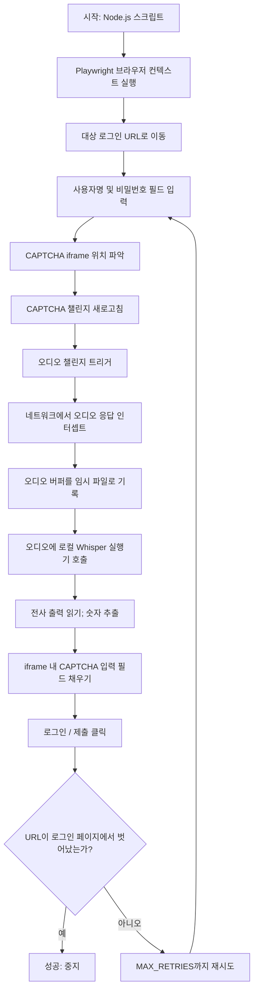
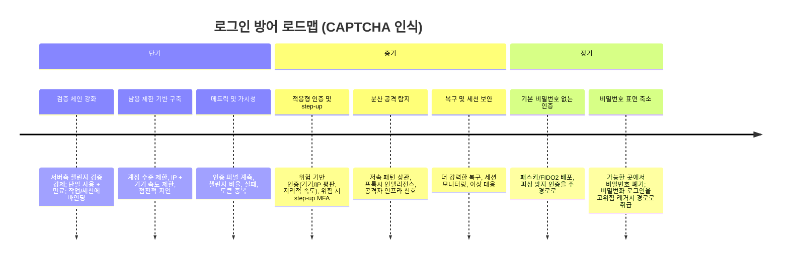

> 이 글은 계정 방어 시리즈의 1편입니다.
>
> - 1편: **해커에게 0원짜리 자동문이 된 캡차 — CAPTCHA 우회 PoC와 방어 전략**
> - 2편: [계정 탈취는 왜 끝나지 않는가 — ATO 공급망의 해부](/ko/post/2026-04-07-dismantling-ato-supply-chain/)
> - 3편: [보안 통제는 부족한 것이 아니라 불편하다 — 그래서 보안은 고객 맥락을 알아야 한다](/ko/post/2026-05-11-adaptive-security-customer-context/)

## 들어가며

웹사이트에 로그인할 때마다 횡단보도 사진을 고르거나, 찌그러진 숫자를 읽어야 하는 경험. 귀찮지만 "이게 내 계정을 지켜주겠지"라는 믿음으로 참아왔습니다.

그런데 그 CAPTCHA가 실제 공격자에게는 0초, 0원에 뚫리는 자동문이라면?

저는 리서치를 읽는 것에 그치지 않고, 직접 PoC(Proof of Concept)를 만들어 검증해 보기로 했습니다.

> 🔗 **전체 소스 코드**: [github.com/windshock/captcha-bypass](https://github.com/windshock/captcha-bypass)

## 관련 영상



## PDF



---

## 오픈소스 세 개로 만든 자동 우회 파이프라인

사용한 도구는 세 가지입니다. 전부 무료 오픈소스.

- **Playwright** — Microsoft가 만든 브라우저 자동화 프레임워크. 눈에 보이지 않는 유령이 키보드와 마우스를 대신 움직여주는 도구입니다.
- **Whisper (tiny)** — OpenAI의 음성 인식 모델. 인터넷 연결 없이 로컬에서 돌아가는 초경량 버전을 사용했습니다.
- **Alibaba Page-Agent** — LLM(대형 언어 모델)이 웹 페이지의 DOM 구조를 이해하고, 자연어 지시만으로 버튼을 찾아 클릭하는 AI 에이전트.

파이프라인의 동작 흐름은 이렇습니다:

1. Playwright가 로그인 페이지를 열고 아이디/비밀번호를 입력
2. CAPTCHA iframe 안으로 진입
3. Page-Agent가 "오디오 재생 버튼을 눌러"라는 자연어 지시를 받아 DOM을 탐색하고 버튼을 클릭
4. Playwright가 네트워크 계층에서 오디오 데이터를 가로챔 (소리가 스피커로 나오기도 전에)
5. Whisper가 노이즈 속에서 숫자를 추출 (예: 7, 6, 0, 0, 4, 9)
6. 추출한 숫자를 입력란에 채우고 제출
7. 로그인 완료

비용: $0. 유료 API 없음. 클라우드 없음. 100% 로컬.

---

## LLM 에이전트가 바꿔놓은 게임의 규칙

여기서 가장 주목할 부분은 Page-Agent입니다.

기존의 웹 자동화는 CSS 셀렉터를 하드코딩하는 방식이었습니다. `#loginname`, `.btnSound`, `#captchaTxt` 같은 정확한 주소를 코드에 박아 넣어야 했죠. 사이트가 UI를 살짝만 바꿔도 스크립트가 깨집니다. 방어자 입장에서는 DOM 구조를 난독화하거나 셀렉터를 자주 바꾸는 것이 일종의 방어였습니다.

하지만 LLM 기반 에이전트는 셀렉터를 모릅니다. 대신 페이지를 "읽습니다." 사람이 화면을 보고 "저 스피커 아이콘을 누르면 되겠다"고 판단하는 것과 같은 방식으로, LLM이 DOM 트리를 분석하고 자연어 지시를 실행합니다.

이것은 방어의 전제를 뒤집는 변화입니다. DOM 난독화는 더 이상 유효한 방어가 아닙니다.

---

## 한글 숫자 인식이라는 뜻밖의 난관

재미있었던 기술적 챌린지가 하나 있습니다.

Whisper는 한국어 오디오 CAPTCHA의 숫자를 인식할 때, "팔, 2, 0, 2, 7, 4"처럼 한글과 아라비아 숫자를 섞어서 출력합니다. 기존 코드는 아라비아 숫자만 추출하는 정규식(`/[^0-9]/g`)을 사용했기 때문에, "팔"(=8)이 통째로 날아가 버렸습니다.

이를 해결하기 위해 한글 숫자 매핑 함수(`extractDigits`)를 만들었습니다. 영(0), 일(1), 이(2)부터 구(9)까지, 그리고 Whisper가 종종 잘못 듣는 변형(공→0, 빵→0, 우→5 등)까지 포함하는 매핑 테이블입니다.

사소해 보이지만, 이런 디테일이 파이프라인의 성공률을 좌우합니다.

---

## Docker 기반 로컬 테스트 환경

실제 서비스를 대상으로 반복 테스트하는 것은 윤리적으로도 법적으로도 문제가 됩니다. 그래서 Docker로 목(mock) 사이트를 만들었습니다.

- 실제 서비스의 HTML 셀렉터를 그대로 재현한 로그인 페이지
- Google TTS로 생성한 한국어 6자리 숫자 오디오 CAPTCHA
- Google reCAPTCHA v2 테스트 키를 사용한 듀얼 모드 (커스텀 오디오 / reCAPTCHA 전환 가능)
- `docker compose up -d` 한 줄로 실행

이렇게 하면 실제 서비스에 영향을 주지 않으면서도 자동화 스크립트를 반복 검증할 수 있습니다. 보안 연구에서 재현 가능한 테스트 환경은 필수입니다.

---

## 코드를 못 짜도 됩니다 — 우회 산업 생태계

PoC를 직접 만드는 것은 사실 어려운 쪽에 속합니다. 실제로 대부분의 공격자는 코드를 짜지 않습니다. 이미 상품화된 시장이 있기 때문입니다.

**인간 솔버 마켓플레이스**

2Captcha, Anti-Captcha 같은 서비스는 개발도상국의 실제 인력이 CAPTCHA를 풀어줍니다. 가격은 1,000건당 $0.5~$2. 건당 0.1원도 안 됩니다. Anti-Captcha는 "100%의 CAPTCHA가 인간 작업자에 의해 해결된다"고 대놓고 광고합니다.

**언블로커 API**

Bright Data, Zyte 같은 서비스는 한 단계 더 나아갑니다. 프록시 로테이션, 브라우저 핑거프린팅 위장, CAPTCHA 자동 해결을 하나의 API로 패키징합니다. 가격은 성공한 결과 1,000건당 $1~$1.5. 실패하면 과금도 안 됩니다.

방어에는 수억 원, 공격에는 커피 한 잔 값. 이것이 CAPTCHA 보안의 실제 경제학입니다.

---

## 학술 연구가 이미 경고해왔다

이 결과는 새로운 것이 아닙니다.

- **unCaptcha** (USENIX WOOT 2017): reCAPTCHA 오디오 챌린지를 85.15% 정확도, 평균 5.42초에 풀었습니다. Google은 이후 오디오를 숫자에서 문구(phrases)로 전환했지만, 그 대응도 완벽하지 않습니다.
- **NDSS 2023**: "Attacks as Defenses" 논문에서 음성 인식 공격에 강건한 오디오 CAPTCHA 설계를 제안했지만, 기성 음성 인식 서비스가 최대 98.3% 정확도를 달성한다는 점도 함께 보고했습니다.
- **Motoyama et al.** (USENIX Security 2010): CAPTCHA 솔빙 서비스의 경제적 구조를 분석한 기초 연구. 15년 전에 이미 "견고한 솔빙 생태계"의 존재를 보고했습니다.

학계는 오래전부터 "오디오 CAPTCHA는 구조적으로 ASR에 취약하다"고 경고해 왔습니다. 이 PoC는 그 경고를 코드 수준에서 검증한 것에 불과합니다.

---

## 오픈소스 우회 무기고 — 모든 CAPTCHA 유형이 뚫린다

이 PoC는 오디오 CAPTCHA 하나만 다뤘지만, GitHub에는 모든 유형의 CAPTCHA를 우회하는 오픈소스 도구가 이미 공개되어 있습니다. 몇 가지를 분석해 보겠습니다.

### Google의 STT로 Google의 CAPTCHA를 푼다

[sarperavci/GoogleRecaptchaBypass](https://github.com/sarperavci/GoogleRecaptchaBypass)는 reCAPTCHA v2의 오디오 챌린지를 5초 이내에 풀어버립니다. 원리는 허탈할 정도로 간단합니다:

1. 체크박스 클릭 → 자동 통과가 안 되면 오디오 챌린지로 전환
2. 오디오 MP3를 다운로드 → WAV로 변환
3. **Google의 Speech-to-Text API** (`speech_recognition.recognize_google()`)로 음성 인식
4. 인식 결과를 입력하고 제출

네, Google의 자체 음성 인식으로 Google의 CAPTCHA를 풀고 있습니다. 종속성은 `pydub`, `SpeechRecognition`, `DrissionPage` 세 개뿐입니다.

### GPT-4o의 눈으로 이미지 챌린지를 읽는다

[aydinnyunus/ai-captcha-bypass](https://github.com/aydinnyunus/ai-captcha-bypass)는 LLM의 멀티모달 능력으로 거의 모든 유형의 CAPTCHA를 돌파합니다:

- **텍스트 CAPTCHA**: 찌그러진 문자 이미지를 GPT-4o/Gemini에 보내면 바로 읽어냅니다
- **reCAPTCHA v2 이미지 선택**: 지시문 스크린샷 → LLM이 "motorcycles"를 식별 → 각 타일을 병렬로 LLM에 전송 → 해당 객체가 있는 타일만 클릭
- **슬라이더 퍼즐**: 스크린샷 → LLM이 픽셀 거리를 추정 → 인간 유사 드래그 → 보정 반복
- **오디오**: GPT-4o-transcribe 또는 Gemini로 음성 인식

이것이 의미하는 바는 명확합니다. "이미지를 더 어렵게 만들면 된다"는 대응은 LLM 앞에서 무력합니다. GPT-4o가 모터사이클 사진을 못 고를 이유가 없습니다.

### 스텔스 브라우저로 행동 분석을 우회한다

[Theyka/Turnstile-Solver](https://github.com/Theyka/Turnstile-Solver)는 Cloudflare Turnstile을 우회합니다. Turnstile은 보이지 않는 JS 챌린지로 브라우저 환경과 사용자 행동을 분석하는 "차세대" CAPTCHA인데, 이것도 뚫립니다:

1. 대상 사이트의 `sitekey`를 포함한 **가짜 HTML 페이지**를 생성
2. `page.route()`로 대상 URL을 가로채서 이 가짜 HTML을 렌더링 — Turnstile JS 입장에서는 정상 도메인
3. **patchright** (Playwright의 자동화 탐지 흔적을 패치한 포크) 또는 **Camoufox** (안티 핑거프린팅 Firefox)에서 위젯 실행
4. Turnstile이 "정상 사용자"로 판정 → 토큰 발급 → 추출

"행동 분석으로 봇을 잡겠다"는 방어가 정면으로 도전받는 사례입니다. patchright는 `navigator.webdriver` 같은 자동화 탐지 신호를 제거하는 것이 존재 이유이고, Camoufox는 브라우저 핑거프린트 자체를 위장합니다.

### CAPTCHA의 구조적 한계

이 세 도구를 합치면 그림이 완성됩니다:

| CAPTCHA 유형 | 우회 방법 | 도구 |
|---|---|---|
| 오디오 (숫자) | ASR / Whisper | 이 PoC, GoogleRecaptchaBypass |
| 오디오 (문구) | LLM 음성 인식 | ai-captcha-bypass (GPT-4o-transcribe) |
| 이미지 선택 | LLM 비전 | ai-captcha-bypass (GPT-4o/Gemini) |
| 텍스트 왜곡 | LLM OCR | ai-captcha-bypass |
| 슬라이더 퍼즐 | LLM 좌표 추정 | ai-captcha-bypass |
| 행동 분석 (Turnstile) | 스텔스 브라우저 | Turnstile-Solver (patchright/Camoufox) |

모든 CAPTCHA 유형에 대한 오픈소스 우회가 이미 존재합니다. 이 표는 단일 장애 지점(CAPTCHA)에 의존하는 방어가 왜 위험한지를 보여줍니다.

---

## 그래서 어떻게 방어해야 하는가

NIST SP 800-63B-4와 OWASP Credential Stuffing Prevention 가이드가 공통으로 내리는 결론은 명확합니다.

> CAPTCHA는 방어가 아니라 마찰(friction)이다.

여기서 한 걸음 더 나아가야 합니다. 기존의 교과서적 권고안—서버측 토큰 검증, 계정 단위 속도 제한—을 이 PoC의 공격 체인에 실제로 대입해 보면 허점이 드러납니다.

- **서버측 토큰 단일사용 검증**: 이 PoC는 토큰을 재사용하지 않습니다. 매번 새 CAPTCHA를 정직하게(?) 풀기 때문에, 단일사용 토큰은 이 공격을 막지 못합니다.
- **계정 단위 속도 제한**: 크리덴셜 스터핑은 같은 계정을 반복 시도하는 게 아닙니다. 유출된 수백만 개의 서로 다른 계정을 돌립니다. 계정당 1~2회면 충분하므로 속도 제한에 걸리지 않습니다.

이것이 "CAPTCHA를 잘 쓰는 법"에만 초점을 맞추면 안 되는 이유입니다. 진짜 필요한 것은 **CAPTCHA가 뚫린 후를 가정한 방어**입니다.

### 1단계: 봇을 봇답게 잡아라 — 행동 분석

첫 번째 방어선으로서 여전히 유효합니다.

Playwright는 입력을 "기계적으로 완벽하게" 합니다. 마우스 움직임 없이 정확한 좌표 클릭, 일정한 간격의 키 입력, 스크롤 없는 페이지 탐색. 인간은 그렇지 않습니다.

서버측에서 이런 행동 신호를 수집하고 분석하세요. Cloudflare Turnstile이 이미 이 접근을 취하고 있습니다—보이지 않는 JS 챌린지로 브라우저 환경과 사용자 행동을 분석하고, 점수가 낮으면 추가 챌린지를 트리거합니다.

다만 **Turnstile-Solver가 보여주듯 이것만으로는 부족합니다**. patchright(Playwright 자동화 탐지 우회 포크)와 Camoufox(안티 핑거프린팅 Firefox)는 행동 분석을 정면으로 무력화합니다. 상용 언블로커들도 인간 유사 마우스 궤적과 타이핑 패턴 시뮬레이션을 이미 제공합니다. 행동 분석은 진입 장벽을 높이지만, 그 자체가 결정적 방어는 아닙니다.

### 2단계: 오디오 챌린지 자체를 강화하라

이 PoC가 성공한 직접적인 이유는 "6자리 숫자"라는 단순한 오디오 형식입니다.

- **숫자 → 문구 전환**: Google이 unCaptcha 공개 이후 실제로 취한 대응입니다. 이 PoC의 Whisper 파이프라인은 숫자 추출에 특화되어 있으므로, 문구 기반으로 전환하면 즉시 무력화됩니다.
- **ASR 적대적 노이즈 추가**: NDSS 2023 "Attacks as Defenses" 논문에서 제안한 접근. 인간은 이해할 수 있지만 기계는 혼동하는 특수 노이즈를 오디오에 삽입합니다.
- **세션당 오디오 발급 횟수 제한**: 접근성을 해치지 않으면서, 세션당 오디오 재생/새로고침 횟수에 상한을 두세요.

### 3단계: 근본 원인을 공격하라 — 유출 비밀번호 사전 차단

크리덴셜 스터핑의 전제는 "유출된 비밀번호가 다른 사이트에서도 통한다"는 것입니다. 이 전제를 깨는 것이 CAPTCHA보다 훨씬 효과적입니다.

- 로그인 시 비밀번호 해시를 Have I Been Pwned API 등 유출 DB와 대조
- 유출된 비밀번호로 로그인 성공 시, 즉시 step-up 인증 요구 또는 비밀번호 변경 강제
- 이것은 "CAPTCHA를 잘 풀든 못 풀든" 상관없이 작동하는 방어입니다

### 4단계: 뚫린 후를 가정하라 — 로그인 후 이상 탐지

CAPTCHA를 뚫고 비밀번호도 맞췄다고 해서 끝이 아닙니다.

자동화된 크리덴셜 스터핑 봇은 로그인 후 특정 패턴을 보입니다: 로그인 직후 포인트 잔액 조회/전환만 하고 로그아웃, 프로필 열람 없이 특정 API만 호출, 비정상적으로 짧은 세션 등. 이런 로그인 후 행동 패턴을 탐지하고 세션을 중단하세요.

### 5단계: 비밀번호를 없애라 — MFA/Passkey

유일하게 공격 체인을 완전히 끊는 방어입니다. CAPTCHA를 뚫든, 비밀번호를 알든, 두 번째 인증 요소가 없으면 로그인이 불가능합니다.

- 단기적으로는 SMS/TOTP 기반 MFA
- 장기적으로는 Passkey/FIDO2로 비밀번호 자체를 제거
- FIDO Alliance가 말하듯, 비밀번호가 없으면 크리덴셜 스터핑이 원천 불가능

다만 현실적으로 전면 도입까지 시간이 필요합니다. 그래서 1~4단계가 그 사이를 메우는 방어입니다.

---

## 이 PoC가 입증한 것

이 저장소는 프록시 풀, 분산 인프라, 고급 브라우저 위장 같은 고도화된 상용 bypass 기법을 구현하지 않았습니다. 그럼에도 Playwright + Whisper + Page-Agent라는 무료 조합만으로 end-to-end 로그인 성공을 달성했습니다.

동시에, 이 PoC가 "항상 성공하는 도구"가 아니라는 점도 명시합니다. DOM 구조 변경, 오디오 엔드포인트 변경, 문구 기반 CAPTCHA 전환 등 여러 조건에서 즉시 깨질 수 있습니다. 하지만 그것이 핵심은 아닙니다.

핵심은 이것입니다: 무료 도구만으로도 오디오 CAPTCHA를 우회할 수 있다면, 수십 억 건의 유출 비밀번호와 건당 $0.001 이하의 상용 솔버를 가진 공격자가 동일한 일을 하지 못할 이유가 없습니다.

CAPTCHA는 속도 방지턱이지, 콘크리트 장벽이 아닙니다.

> 🔗 **전체 소스 코드와 Docker 테스트 환경**: [github.com/windshock/captcha-bypass](https://github.com/windshock/captcha-bypass)

---

## 참고 자료

- NIST SP 800-63B-4 — Digital Identity Guidelines: Authentication and Authenticator Management
  https://pages.nist.gov/800-63-4/sp800-63b.html
- OWASP — Credential Stuffing Prevention Cheat Sheet
  https://cheatsheetseries.owasp.org/cheatsheets/Credential_Stuffing_Prevention_Cheat_Sheet.html
- Cloudflare Turnstile — Server-Side Validation
  https://developers.cloudflare.com/turnstile/get-started/server-side-validation/
- Google reCAPTCHA — Verifying the user's response
  https://developers.google.com/recaptcha/docs/verify
- FIDO Alliance — Passkeys
  https://fidoalliance.org/passkeys/
- Have I Been Pwned — Pwned Passwords API
  https://haveibeenpwned.com/API/v3#PwnedPasswords
- unCaptcha (USENIX WOOT 2017) — A Low-Resource Defeat of reCaptcha's Audio Challenge
  https://www.usenix.org/conference/woot17/workshop-program/presentation/bock
- Motoyama et al. (USENIX Security 2010) — Re: CAPTCHAs
  https://static.usenix.org/event/sec10/tech/full_papers/Motoyama.pdf
- NDSS 2023 — Attacks as Defenses: Designing Robust Audio CAPTCHAs
  https://www.ndss-symposium.org/ndss-paper/attacks-as-defenses-designing-robust-audio-captchas-using-attacks-on-automatic-speech-recognition-systems/
- Theyka/Turnstile-Solver — Cloudflare Turnstile 우회 도구
  https://github.com/Theyka/Turnstile-Solver
- sarperavci/GoogleRecaptchaBypass — Google STT를 이용한 reCAPTCHA 우회
  https://github.com/sarperavci/GoogleRecaptchaBypass
- aydinnyunus/ai-captcha-bypass — LLM 멀티모달 CAPTCHA 솔버
  https://github.com/aydinnyunus/ai-captcha-bypass

---

## 부록: Deep Research Report

### CAPTCHA 우회 생태계 및 로그인 방어 전략 보고서

> **번역 기준일:** 2026-03-26

---

## 요약 (Executive Summary)

CAPTCHA 우회는 이미 상품화된 "보안 노동력 + 자동화" 공급망으로 성숙했습니다. 저가 시장에서는 **인간 솔버 마켓플레이스**가 대부분의 주류 챌린지 유형(이미지 CAPTCHA, reCAPTCHA 변형, Turnstile 등)에 대해 대략 **1,000건당 $1 미만~수 달러** 수준으로 솔루션을 판매합니다. 예를 들어, [2Captcha](https://2captcha.com/pricing)는 이미지 CAPTCHA **$0.5–$1/1,000건**, reCAPTCHA v2 변형 **$1–$2.99/1,000건**, Turnstile **$1.45/1,000건**, 오디오 CAPTCHA **$0.5/1,000건**으로 가격을 게시합니다. [Anti-Captcha](https://anti-captcha.com/price)도 유사한 볼륨 할인 가격(예: 이미지 **$0.5–$0.7/1,000건**; reCAPTCHA v2 **$0.95–$2/1,000건**; Turnstile **$2/1,000건**)을 제공하며, "CAPTCHA의 **100%**가 **인간 작업자**에 의해 해결된다"고 명시합니다.

고가 시장에서는 **"언블로커" 제품**(스크래핑/차단 해제 API)이 **프록시 + 핑거프린팅 + 재시도 + CAPTCHA 해결**을 "성공 시 과금" 방식으로 패키징합니다. [Bright Data Web Unlocker](https://brightdata.com/pricing/web-unlocker)는 **$1K 결과당 가격**(예: 종량제 **$1.5/1K 결과**; 월간 고비용 티어에서 **$1.0–$1.3/1K**)으로 제공되며, **CAPTCHA 해결** 및 **브라우저 핑거프린팅** 등의 기능을 명시합니다. [Zyte](https://www.zyte.com/pricing/)는 "성공 응답 1,000건당" 가격에 **단계별 요금**을 적용하고, **captcha**를 플랫폼의 "차단 처리" 모델의 일부로 포함합니다.

기술적으로 우회 접근 방식은 인식 가능한 분류 체계로 나뉩니다:

1. **인간 중계** 및 "captcha 농장"
2. **ML/OCR/ASR** (특히 오디오 숫자/구문 챌린지에 효과적)
3. **브라우저/세션 조작** (자동화 + 스텔스 + 챌린지 오케스트레이션)
4. **접근성/오디오 남용**
5. **토큰/검증 체인 남용** (서버측 검증이 약한 경우의 재전송/위조)
6. **행동 기반 회피** (예상 핑거프린트/행동을 매칭하여 챌린지 회피)

학술 연구는 오래전부터 CAPTCHA를 **경제적 경쟁**—우회 비용 대 보호 자산 가치—으로 분석할 수 있다고 주장해 왔으며, 이는 자동화와 실시간 인간 노동력을 결합한 "견고한 솔빙 생태계"에 의해 뒷받침됩니다. 특히 오디오 CAPTCHA는 저자원 음성 인식 공격에 반복적으로 취약한 것으로 나타났습니다: [**unCaptcha**](https://www.usenix.org/conference/woot17/workshop-program/presentation/bock) 프로젝트는 reCAPTCHA 오디오 챌린지에서 **~5.42초** 만에 **85.15%** 정확도를 보고했습니다(Google이 숫자에서 구문으로 대응 조치를 전환했다는 점도 기록). 더 넓은 "오디오 CAPTCHA 생태계"에 대한 연구도 기성 음성 인식 서비스를 사용한 높은 정확도를 보여줍니다(예: 한 연구에서 "Google Re-Captcha에 대해 최대 **98.3%**").

방어적 관점에서 이는 **CAPTCHA를 보조 마찰 도구로 취급해야 하며**, 크리덴셜 스터핑, 자동 계정 생성, 비밀번호 스프레이를 중지하기 위한 주요 통제 수단이 아님을 의미합니다. 현대적 가이던스는 계층적 통제를 강조합니다: MFA/패스키, 위험 기반 step-up, 분산 공격을 고려한 속도 제한. [OWASP](https://cheatsheetseries.owasp.org/cheatsheets/Credential_Stuffing_Prevention_Cheat_Sheet.html)는 MFA를 크리덴셜 스터핑에 대한 가장 강력한 방어로 강조하며, 심층 방어 모델에서 대체 방어(CAPTCHA 포함)를 논의합니다. [NIST SP 800-63B-4](https://pages.nist.gov/800-63-4/sp800-63b.html)는 검증자가 실패한 인증 시도에 대해 **속도 제한을 반드시 구현**해야 하며, **피싱 방지 인증** 옵션(예: FIDO/WebAuthn 클래스)을 제공/장려해야 한다고 강조합니다. 전략적 방향은 명확합니다: **피싱 방지, 재전송 방지 인증**(패스키/FIDO2)을 우선시하고, 적응형 step-up과 함께 **분산 남용 탐지**를 구축하며; CAPTCHA는 여러 신호 중 하나로 유지합니다.

제공된 시드 번들의 사례 연구(**오디오 CAPTCHA** 네트워크 응답을 캡처하고 **로컬 Whisper** 호출로 전사하는 Playwright 자동화)는 주로 **접근성/오디오 남용 + ASR 보조 솔빙**에 매핑되며, **브라우저 자동화** 및 **네트워크 응답 인터셉션**과 결합됩니다. 이는 방어자 관련 압력 지점을 드러냅니다: (a) "숫자/구문"인 오디오 챌린지는 ASR 기반 우회와 구조적으로 호환되고, (b) 속도 제한 및 세션 바인딩이 없으면 자동화가 대규모로 챌린지 미디어를 수집할 수 있으며, (c) 서버측 챌린지 검증(토큰 바인딩, 단일 사용 의미론, 만료)의 약점은 우회 ROI를 증폭시킵니다.

---

## 시장 지도 (Market Map)

아래 표는 생태계의 대표적 단면을 요약합니다. 가격은 **벤더 사이트에 게시된 기준**이며(변동 가능성 높음), 목적은 **서비스 모델**과 **역량**을 매핑하는 것이지 사용을 권장하는 것이 아닙니다.

| 벤더 / 제품 | 서비스 모델 | 가격 모델 (예시) | 주요 지원 챌린지 유형 (예시) | 방어자를 위한 참고사항 |
|---|---|---|---|---|
| [2Captcha](https://2captcha.com/pricing) | 인간 솔버 마켓플레이스 + API | 1,000건당: 이미지 CAPTCHA **$0.5–$1**; reCAPTCHA v2 변형 **$1–$2.99**; Turnstile **$1.45**; 오디오 CAPTCHA **$0.5** | reCAPTCHA (v2/v3/엔터프라이즈 변형), Turnstile, Arkose/FunCaptcha, GeeTest, 오디오/텍스트/이미지 유형 | 다수 CAPTCHA에 대한 **상품 가격대**를 보여줌; 계정 가치가 비사소한 경우 계정 생성 및 크리덴셜 스터핑 파이프라인에 통합하기에 "충분히 저렴" |
| [Anti-Captcha](https://anti-captcha.com/price) | 인간 솔버 마켓플레이스 + API | 1,000건당 볼륨 할인: 이미지 **$0.5–$0.7**; reCAPTCHA v2 **$0.95–$2**; reCAPTCHA v3 **$1–$2**; Arkose **$3**; Turnstile **$2** | reCAPTCHA v2/v3/Enterprise, Turnstile, GeeTest, Arkose 및 "커스텀 태스크" | **100% 인간** 해결을 명시적으로 주장하고 매우 높은 가동률; 브라우저 플러그인도 판매 |
| [CapSolver](https://docs.capsolver.com/en/pricing/) | 자동화 솔버 API (AI 우선 포지셔닝) | 1,000 토큰당: reCAPTCHA v2 **$0.80**; Turnstile **$1.20**; Cloudflare Challenge **$1.20**; reCAPTCHA v3 Enterprise **$3.00**; GeeTest **$1.20**; ImageToText **$0.40** | reCAPTCHA 변형, Turnstile, Cloudflare Challenge, GeeTest, AWS WAF 관련 태스크, 이미지-텍스트 등 | 자동화 우선 서비스는 순수 인간 중계 대비 지연 시간과 운영 복잡도를 감소; 방어자는 더 높은 처리량과 스케일링을 예상해야 함 |
| [CapMonster Cloud](https://capmonster.cloud/en/prices) | 자동화 솔버 API + 확장 | Turnstile **$1.30/1k 토큰**; reCAPTCHA v3 **$0.90/1k 토큰**; DataDome **$2.20/1k 토큰**; 텍스트 CAPTCHA **$0.30/1k 토큰**; reCAPTCHA v2 토큰 가격 **$0.60/1k** | reCAPTCHA v2/v3/Enterprise, Turnstile, Cloudflare Bot Challenge, GeeTest, DataDome, Amazon WAF 등 | 일부 태스크에 프록시가 "가격에 포함"됨을 주장; 통합 솔버 + 프록시 번들링은 공격자 마찰을 줄이고 IP 기반 방어를 복잡하게 할 수 있음 |
| [Death By Captcha](https://deathbycaptcha.com/user-pay) | 하이브리드: OCR + 인간 인력 | 낮은 가격 **$1.39/1,000 디코딩 CAPTCHA**; 유형별 가격(예: 오디오 CAPTCHA **$0.59/1K**, Turnstile **$2.89/1K**, reCAPTCHA V2/V3/Invisible **$2.89/1K**) | "일반 CAPTCHA", reCAPTCHA 변형, Turnstile, GeeTest 등 | 하이브리드 포지셔닝 중요: "AI 우선, 어려운 건 인간"은 일반적인 복원력 패턴으로 기본 우회 신뢰성을 높임 |
| [Bright Data Web Unlocker](https://brightdata.com/pricing/web-unlocker) | 언블로커 API (프록시 + 브라우저 에뮬레이션 + 재시도 + CAPTCHA 해결) | 종량제 **$1.5/1K 결과**; 고비용 티어 예: **380K 결과 $499/월 $1.3/1K**, **2M 결과 $1999/월 $1/1K** | CAPTCHA 유형별이 아닌 안정적 차단 해제의 구성 요소로서 자동 CAPTCHA 해결 | **브라우저 핑거프린팅** 및 다계층 에뮬레이션(네트워크/프로토콜/브라우저/OS 신호)을 명시적으로 마케팅, "행동 기반 회피" 전략과 일치 |
| [Zyte API](https://www.zyte.com/pricing/) | 언블로커/스크래핑 API, 단계별 "성공 응답" 과금 | 종량제 HTTP **$0.13–$1.27/1,000**; 브라우저 렌더링 **$1.01–$16.08/1,000**, 약정 시 할인 | "차단 처리"로 포지셔닝, 사이트별 필요 기법을 번들링(챌린지 해결 포함 가능) | 중요한 방어자 시사점: 공격자가 "스텔스 + 솔빙"을 외주화할 수 있어 단순한 봇 휴리스틱의 효과가 감소 |
| [ZenRows](https://www.zenrows.com/pricing) | 언블로커/스크래핑 API | 플랜 티어(예: **$129/월** 플랜, "보호된 결과"), "CAPTCHA 우회" 및 성공 시 과금 | "CAPTCHA 우회"가 "안티봇 우회" 역량의 일부로 포지셔닝; 스니펫에서 CAPTCHA 브랜드별 열거 없음 | "API 한 번 호출"로 우회 작업 외주화의 또 다른 사례; 공격자 규모를 증가시키고 운영 복잡도를 낮춤 |
| [Scrapfly](https://scrapfly.io/pricing) | 언블로커 API | 구독 가격 **$30/월**(Discovery)부터, 종량제 포함(예: "Pro"에서 **$3.50/10k**) | **reCAPTCHA, hCaptcha, Turnstile**에 CAPTCHA 해결 포함, 성공 시에만 과금 주장 | 조정된 핑거프린트 데이터포인트(canvas/WebGL/오디오/TLS/JA3) 및 적응형 전략을 명시적으로 설명, 현대적 봇 회피 패턴과 일치 |

---

## 기법 분류 체계 (Technique Taxonomy)

아래 분류 체계는 **방어자 관점의** 이해를 강조합니다: 각 기법 류가 달성하는 것, 생성하는 경향이 있는 신호, 공격자 ROI를 줄이는 완화 조치. 예시는 의도적으로 **비운영적**입니다(단계별 가이던스 없음).

| 기법 패밀리 | 설명 | 공격자의 일반적 이점 | 탐지 신호 (방어자 관점) | 실용적 완화 조치 (방어자 관점) |
|---|---|---|---|---|
| **인간 중계 및 "captcha 농장"** | 실제 인간이 챌린지를 해결(때로 API를 통해; 때로 브라우저 플러그인을 통해). 이것은 CAPTCHA 생태계의 경제 분석에서 설명되는 고전적인 "실시간 인간 노동력" 우회 시장 | 퍼즐 유형 전반에 걸친 높은 호환성; 빈번한 CAPTCHA 변경에 대한 복원력; 대규모에서 상대적으로 낮은 비용(게시된 시장 가격) | 솔빙 시도가 자동화 워크플로와 상관: 비정상적 동시성, 반복적 양식 제출, 비정상적 지역/IP 혼합, 높은 비율의 계정 생성 또는 로그인 시도 | CAPTCHA를 **마찰**로 취급하되 게이트로는 아님: 강력한 인증(MFA/패스키) 강제, 계정 및 자격 증명당 제한, 위험도에 따른 step-up 트리거 |
| **ML/OCR 비전 솔빙** | 텍스트/이미지 CAPTCHA의 자동 인식; 현대 딥러닝이 OCR 성능을 크게 향상 | 시도당 매우 낮은 한계 비용, 낮은 지연 시간, 대규모 자동화에 내장 가능 | 높은 솔빙 처리량; 모델이 과일반화하면서 "버스트"로 나타나는 반복적 실패 패턴; 동일 자동화 스택 사용 시 일관된 클라이언트 핑거프린트 | **증명/증명서 스타일** 신호 및 서버측 검증 선호; 자동화 위험이 높을 때 피싱 방지 인증으로 degradation/step-up |
| **오디오 챌린지용 ML/ASR** | 오디오 CAPTCHA를 전사하기 위한 음성-텍스트 변환(상용 ASR 서비스 포함). [unCaptcha](https://www.usenix.org/conference/woot17/workshop-program/presentation/bock)는 강력한 성능과 대응 조치에 대한 지속적 적응(숫자 → 구문)을 보고. 연구들은 기성 음성 인식을 사용한 다수 오디오 CAPTCHA 제공자에 대한 매우 높은 정확도도 보고 | 오디오 CAPTCHA는 접근성을 위한 "약한 대체 수단"이 되지만, ASR은 저렴하고 빠를 수 있음 | 오디오 챌린지 요청의 급증(또는 반복 새로고침), 대규모에서의 비정상적 완료 시간(너무 빠름), 실패한 오디오 시도의 비정상적 분포 | 접근성을 해치지 않으면서 오디오 대체 남용 제한: 강력한 세션별 바인딩, 단일 사용 의미론, 공격적인 오디오 발급 속도 제한, 위험 기반 step-up으로 오디오가 고위험 작업의 유일한 게이트가 되지 않도록 |
| **브라우저 자동화 및 세션 조작** | 완전한 브라우저 자동화(Playwright/Puppeteer/Selenium) + 스텔스/안티디텍트 레이어; "응답 인터셉션", 강제 렌더링 경로, 쿠키/세션 처리 등 포함 가능. 일부 상용 플랫폼은 전체적인 "브라우저 핑거프린팅 + 재시도 + CAPTCHA 해결"을 마케팅 | 우회는 단순히 "CAPTCHA 풀기"가 아니라 "챌린지를 받지 않을 정도로 정상적으로 보이기"이며, 재시도/프록시 로테이션을 통해 차단에서 복구 | 높은 자동화 상관: 다수 계정에 걸쳐 동일한 TLS/클라이언트 힌트/헤더 순서; 비정상적 탐색 시간; 비정상적 헤드리스 아티팩트(현대 스텔스로도 상관관계 유지) | 방어를 **계정 수준** 및 **행동 수준**으로 전환: 분산 공격 탐지, 기기 바인딩, 이상치 점수화, 브라우저 표면에만 의존하지 않는 step-up 인증 |
| **토큰 및 검증 체인 남용** | 약한 검증 의미론 악용: 클라이언트측에서만 검증, 서버측 토큰 검증 실패, 토큰 재전송, 또는 컨텍스트 외 토큰 사용. [Cloudflare](https://developers.cloudflare.com/turnstile/get-started/server-side-validation/)는 "클라이언트측 위젯만으로는 보호를 제공하지 않음", 토큰이 위조될 수 있고 빠르게 만료되며 단일 사용임을 명시적으로 경고. [Google](https://developers.google.com/recaptcha/docs/verify)도 reCAPTCHA 응답 토큰이 재전송을 방지하기 위해 단기간 및 단일 사용임을 문서화 | 검증이 잘못된 경우 높은 레버리지: 우회가 "매번 해결"이 아닌 "토큰을 한 번 획득"이 될 수 있음 | 중복 토큰 제출, 윈도우 외 타임스탬프, IP/기기 간 동일 토큰, 백엔드에 클러스터된 검증 실패 | 엄격한 검증 강제: 서버측 검증, 단일 사용 + 만료 강제, 토큰을 컨텍스트(작업, 세션, 기기)에 바인딩, 중복 시 로그/알림 |
| **행동 회피 및 챌린지 회피** | 실제 사용자 신호를 매칭하여 CAPTCHA 트리거 회피. [Turnstile](https://developers.cloudflare.com/turnstile/)은 비대화형 JS 챌린지(증명 작업/공간, API 프로빙, 행동 신호)를 설명하여 챌린지 난이도를 조정 | 낮은 마찰과 높은 처리량: "CAPTCHA가 표시되지 않음"은 건당 해결 비용 없이 더 빠른 자동화를 의미 | 실제 사용자 행동 분포의 드리프트: 비정상적 기기 다양성, 시간대 패턴, 세션 깊이 이상; "성공적" 로그인 증가 후 의심스러운 로그인 후 활동 | 위험 기반 적응형 인증: 로그인 전후 이상 감지; 의심스러운 컨텍스트에서 step-up; 피싱 방지 인증(패스키)으로 비밀번호 의존도 감소 |

---

## 제공된 시드 번들의 사례 연구 매핑

### 분석 대상과 제외 항목

아래 분석은 **llm-handoff-bundle-2026-03-26.zip**(문서, 코드, 제한된 증거 아티팩트)에 명시적으로 존재하는 내용으로 제한됩니다. 주목할 만한 제외 항목(예: **`.env` 자격 증명**, **`models/tiny.pt`**, **node_modules**, 전체 세션 비디오)은 런타임 주장의 재현성과 검증에 실질적인 한계를 만듭니다.

### 아키텍처 및 데이터 플로우

번들의 코드 구조 기반으로, 이 자동화는 **오디오 CAPTCHA 획득 단계**, **로컬 ASR 전사**, 그리고 **양식 제출** 및 재시도 로직을 갖춘 전형적인 "로그인 봇 파이프라인"입니다. 고수준 흐름은 다음과 같습니다:

### 분류 체계 매핑

이 시드 번들은 다음에 가장 직접적으로 매핑됩니다:

- **접근성/오디오 남용 + ASR**: 오디오 챌린지(숫자 전사)를 대상으로 하며, ASR 기반 우회에 대한 오디오 CAPTCHA의 알려진 약점과 일치합니다. 이는 오디오 CAPTCHA에 대한 자동화된 공격의 강력한 성능을 보여주는 공개 연구(예: [unCaptcha](https://www.usenix.org/conference/woot17/workshop-program/presentation/bock) 결과, AudioBreaker 스타일 접근)와 일관됩니다.
- **브라우저 자동화 및 세션 조작**: Playwright를 사용하여 실제 브라우저 세션을 구동하고, 네트워크 인터셉션(특정 응답 패턴 대기)을 사용하여 오디오 페이로드를 캡처합니다. 이는 "언블로커"가 브라우저 수준 에뮬레이션과 자동화를 "내부적으로" 광고하는 광범위한 산업 트렌드와 일치합니다.

### 명시적 가정과 취약 지점

시드 번들의 접근 방식은 실제 배포에서 일반적으로 취약한 가정에 의존합니다:

**DOM 및 iframe 계약 가정.** 코드는 안정적인 셀렉터(로그인 필드, CAPTCHA iframe ID, 오디오 버튼 클래스, 새로고침 버튼 클래스, CAPTCHA 입력 ID)를 가정합니다. 사소한 UI 리팩터링으로도 자동화가 빠르게 깨질 수 있습니다.

**오디오 페이로드의 네트워크 식별.** 캡처 로직은 URL/content-type 휴리스틱으로 응답을 매칭하는 것으로 보입니다. 이는 다른 엔드포인트, 암호화/스트리밍 오디오, 또는 비오디오 content-type(코드가 이미 일부 `.jsp` 응답도 수락하여 예상하는 현상)과 같은 변경에 취약합니다.

**챌린지 형식 가정 ("숫자" / 고정 길이).** 자동화는 제출을 시도하기 전에 최소 길이(예: ≥5자리)의 숫자 전사를 기대하는 것으로 보입니다. 이는 알려진 방어 조치의 영향 범위에 직접 해당합니다: 숫자에서 구문으로의 전환(Google은 [unCaptcha](https://www.usenix.org/conference/woot17/workshop-program/presentation/bock) 공개 후 reCAPTCHA 오디오 챌린지에 대해 이를 수행).

**로컬 모델 재현성 및 공급망 의존성.** Whisper 호출은 로컬 모델 아티팩트(번들에서 누락됨을 명시적으로 호출)와 사용 가능한 Whisper 실행기 + FFmpeg 환경에 의존합니다. 실제로 이는 세 가지 재현성 실패 모드를 만듭니다: 모델 부재, 실행기 부재/오구성, 또는 FFmpeg 부재 — 어느 하나라도 "솔버" 단계를 재시도/실패로 degradation합니다.

### 증거 지지 사실 vs. 미검증 주장

번들 내용을 고려할 때, 엄격한 입장은 다음과 같습니다:

**증거 지지 (코드 및 포함 아티팩트 기준):**
리포지토리는 오디오 캡차 해결 단계와 "최대 N회 재시도" 제어 루프를 갖춘 Playwright 기반 로그인 시도를 구현하며; 로그인 자동화 노력과 일관된 스크린샷/비디오 아티팩트를 포함합니다.

**타당하지만 미검증 (누락된 아티팩트 / 라이브 실행 필요):**
대상 로그인에 대한 실제 성공률, 오디오 인터셉션이 올바른 오디오를 안정적으로 캡처하는지, 그리고 Whisper가 프로덕션 환경에서 충분히 정확한 숫자 추출을 산출하는지. 공개 증거는 오디오 챌린지가 일반적으로 ASR에 취약하다는 것을 강력히 시사하지만, 이 특정 대상 흐름이 end-to-end로 안정적으로 해결 가능함을 증명하지는 않습니다.

### 사례 연구가 드러낸 방어자 관련 완화 조치

이 사례 연구는 **오디오 CAPTCHA**가 왜 **고위험 대체 수단**으로 취급되어야 하는지에 대한 구체적인 예를 제공합니다: 연구와 공개 데모는 높은 성공률로 자동 전사될 수 있음을 보여주며, 방어자는 적대자가 대규모로 오디오를 가져오고 ASR을 적용하는 파이프라인을 구축할 것으로 예상해야 합니다.

완화 교훈은 Turnstile/reCAPTCHA 문서를 반영합니다: "프런트엔드 챌린지"는 **올바른 서버측 검증**(단일 사용 토큰, 짧은 TTL, 올바른 작업/세션에 바인딩)으로 뒷받침되어야 하며, 그렇지 않으면 우회 비용이 붕괴됩니다. Cloudflare는 Turnstile을 서버측에서 검증하지 않으면 "주요 보안 취약점"이 남는다고 명시적으로 경고하며, 만료/단일 사용 의미론을 설명합니다; Google도 reCAPTCHA 응답 토큰에 대해 유사한 단일 사용, 시간 제한 의미론을 문서화합니다.

---

## 방어 권장 사항 및 우선순위 로드맵

### 핵심 원칙: CAPTCHA는 마찰 도구이지 인증 통제 수단이 아님

CAPTCHA는 비정교한 자동화를 줄일 수 있지만, 시장 가격과 ASR/자동화 연구는 **동기 부여된 적대자가 우회 능력을 구매하거나 구축할 수 있음**을 보여줍니다. 따라서 로그인 보호를 위해 CAPTCHA를 분산 자동화 및 자격 증명 침해를 견딜 수 있도록 설계된 더 넓은 시스템의 **보조 신호**로 취급하십시오.

### 우선순위 로드맵

#### 단기 권장 사항

모든 CAPTCHA/봇 챌린지 프로바이더에 대해 **필수 서버측 검증**을 올바르게 구현하십시오. [Cloudflare](https://developers.cloudflare.com/turnstile/get-started/server-side-validation/)는 Turnstile의 클라이언트측 위젯만으로는 불충분하며, 서버측에서 검증하지 않으면 토큰이 위조될 수 있다고 명시적으로 진술합니다; 토큰은 시간 제한 및 단일 사용입니다. [Google](https://developers.google.com/recaptcha/docs/verify)도 reCAPTCHA에 대해 재전송을 방지하기 위한 토큰 단일 사용 + 짧은 유효 기간을 유사하게 문서화합니다. 제공 중인 로그인 흐름이 이 특정 프로바이더를 사용하지 않더라도, 설계 원칙은 보편적입니다: 챌린지 완료는 **검증되고, 바인딩되고, 재전송 방지**되어야 합니다.

**계정 중심**(IP 중심이 아닌) 속도 제한을 배포하십시오. [NIST](https://pages.nist.gov/800-63-4/sp800-63b.html)는 검증자가 구독자 계정당 실패한 인증 시도를 효과적으로 제한하는 속도 제한 메커니즘을 구현하고, 제한에 필요한 상태를 유지하도록 명시적으로 요구합니다. [OWASP](https://cheatsheetseries.owasp.org/cheatsheets/Credential_Stuffing_Prevention_Cheat_Sheet.html)의 크리덴셜 스터핑 가이던스는 방어가 무차별 대입, 크리덴셜 스터핑, 비밀번호 스프레이에 걸쳐 겹치며, CAPTCHA는 계층적 접근의 한 요소에 불과하다고 강조합니다.

#### 중기 권장 사항

**위험 기반 적응형 인증**을 채택하십시오. [OWASP](https://cheatsheetseries.owasp.org/cheatsheets/Credential_Stuffing_Prevention_Cheat_Sheet.html)는 MFA가 가장 강력한 방어라고 기술하며, 컨텍스트 트리거(새 기기/IP, 비정상적 위치, 의심스러운 IP)와 MFA를 결합하는 것을 논의합니다. [NIST](https://pages.nist.gov/800-63-4/sp800-63b.html)도 잠재적 사기 지표 사용을 논의하고 더 높은 보증 수준에서 피싱 방지 옵션을 요구하여 "step-up" 모델과 일치시킵니다.

현대적 회피에 맞춰 조정된 **분산 공격 탐지**를 구축하십시오. CAPTCHA 우회는 프록시 로테이션 및 핑거프린트 관리와 빈번하게 결합됩니다; 이는 "IP별" 휴리스틱의 성능이 저하됨을 의미합니다. 상용 언블로커는 핑거프린팅, 재시도, 프록시 오케스트레이션을 광고합니다; 방어자는 적대자가 이러한 역량을 근사할 수 있다고 가정해야 합니다. 탐지 초점: 교차 계정 상관, 기기 클러스터, 자동화 타이밍 서명, 로그인 후 남용 패턴.

#### 장기 권장 사항

**피싱 방지, 비밀번호 없는 인증**으로 이동하십시오. [FIDO Alliance](https://fidoalliance.org/passkeys/)는 패스키를 피싱 방지로 설명하며, 비밀번호를 탈취 가능한 공유 비밀로 제거함으로써 크리덴셜 스터핑 및 원격 공격을 줄인다고 합니다. [NIST SP 800-63B-4](https://pages.nist.gov/800-63-4/sp800-63b.html)도 더 높은 보증 수준에서 피싱 방지 인증 옵션을 요구/장려합니다.

실질적으로, 장기적 최종 상태는: 비밀번호 기반 로그인이 더 높은 마찰/위험 통제(step-up, 더 엄격한 제한, 추가 증명)를 가진 **레거시 호환성 경로**가 되고, 패스키가 대부분의 사용자와 대부분의 세션에 대한 기본값이 되는 것입니다.

---

## 참고 자료 우선순위

아래 자료들은 엄밀한 딥 리서치 작성과 방어 가능한 완화 계획을 지원하기 위해 우선순위가 매겨져 있습니다.

| 우선순위 | 자료 (중요한 이유) |
|---|---|
| **높음** | [NIST SP 800-63B-4](https://pages.nist.gov/800-63-4/sp800-63b.html) (인증 및 인증자 관리): 제한, 피싱 방지 인증, 상태 관리에 대한 규범적 가이던스 |
| **높음** | [OWASP 크리덴셜 스터핑 방지 치트시트](https://cheatsheetseries.owasp.org/cheatsheets/Credential_Stuffing_Prevention_Cheat_Sheet.html): 실용적 계층 방어, MFA 및 심층 방어 강조(CAPTCHA를 보조로) |
| **높음** | [Cloudflare Turnstile 문서](https://developers.cloudflare.com/turnstile/) ([서버측 검증](https://developers.cloudflare.com/turnstile/get-started/server-side-validation/)): 현대적 "스마트 CAPTCHA" 모델 및 엄격한 검증 요구사항(만료/단일 사용) |
| **높음** | [Google reCAPTCHA 검증 문서](https://developers.google.com/recaptcha/docs/verify): 토큰 제한(단일 사용, 짧은 TTL) 및 서버측 검증 흐름 |
| **높음** | [FIDO Alliance 패스키](https://fidoalliance.org/passkeys/): 피싱 방지 비밀번호 없는 인증의 보안 근거 및 채택 프레이밍 |
| **높음** | [Motoyama 등, "Re: CAPTCHAs" (USENIX Security 2010)](https://static.usenix.org/event/sec10/tech/full_papers/Motoyama.pdf): CAPTCHA 솔빙 생태계의 기초적 경제 프레이밍 |
| **높음** | [unCaptcha 프로젝트](https://www.usenix.org/conference/woot17/workshop-program/presentation/bock): 오디오 CAPTCHA 취약성의 구체적 증거 + 대응 조치 진화(숫자 → 구문) |
| **보통** | ["In (Cyber)Space Bots Can Hear You Speak" (AISEC 2017)](https://dl.acm.org/doi/10.1145/3128572.3140443): 광범위한 오디오 CAPTCHA 생태계 분석; 기성 음성 인식을 사용한 높은 정확도 보고 |
| **보통** | [NDSS "Attacks as Defenses" 오디오 CAPTCHA 연구](https://www.ndss-symposium.org/ndss-paper/attacks-as-defenses-designing-robust-audio-captchas-using-attacks-on-automatic-speech-recognition-systems/): "견고한 오디오 CAPTCHA" 설계 방향 제시, 접근성 대체 수단을 유지해야 하는 경우 관련 |
| **보통** | 벤더 가격/문서 ([2Captcha](https://2captcha.com/pricing), [Anti-Captcha](https://anti-captcha.com/price), [CapSolver](https://docs.capsolver.com/en/pricing/), [CapMonster Cloud](https://capmonster.cloud/en/prices), [DBC](https://deathbycaptcha.com/user-pay)): 시장 매핑, 위협 모델링, 비용 추정용 |
| **보통** | 언블로커 가격/문서 ([Bright Data](https://brightdata.com/pricing/web-unlocker), [Zyte](https://www.zyte.com/pricing/), [ZenRows](https://www.zenrows.com/pricing), [Scrapfly](https://scrapfly.io/pricing)): "외주 스텔스 + 솔빙" 서비스 모델 및 예상 공격자 운영 역량 이해용 |

---
